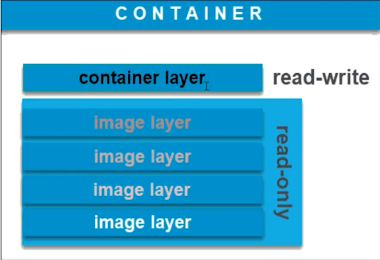
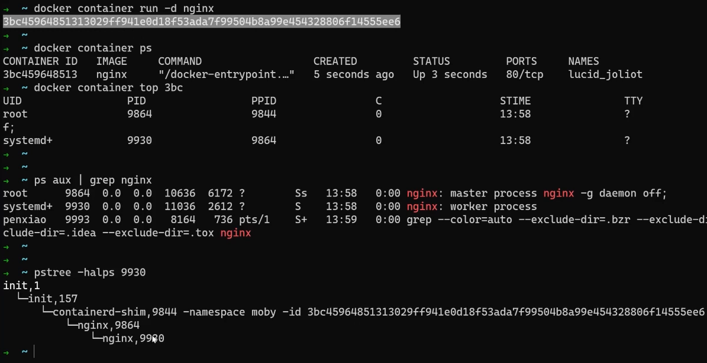

# 1.Doker命令行基础

## 版本、信息、命令、帮助显示

```bash
docker version

docker info

docker

docker container... --help
```

## image 镜像，container 容器

image是只读层，创建container时，在image层之上创建可读可写层（容器层）



基于同一个image可以创建多个container

### 容器的基本操作

```bash
docker container run nginx

# container可以省略
docker run nginx

# 显示所有容器信息
docker ps -a

# 显示所有容器的ID
docker ps -aq

# 停止容器工作
docker stop `hash`

# 删除容器
docker rm `hash`

```

```bash
# 通过$(ID) 停止 所有容器
docker container stop $(docker container ps -aq)

# 通过$(ID) 删除 所有容器
docker container rm $(docker container ps -aq)
```

不能直接删除一个正在运行的程序需要加"-f"，停止并删除

```bash
docker container rm -f `hash`

# 通过$(ID) 强制删除 所有容器
docker container rm -f $(docker container ps -aq)
```

使用`run`命令直接启动起来的容器，是处于链接状态，如果直接ctrl+c会导致容器停止，可以带上`-d`使容器启动时使用分离状态启动

```bash
docker container run -d nginx
```

重新链接容器

```bash
# *****此种链接方式会在ctrl+c时导致容器停止*****
docker attach `hash`
# *****不推荐*****

# 推荐使用
docker exec -it `hash` /bin/bash
#			-i: 交互式操作。
#			-t: 终端。
#			/bin/bash 使用bash链接
```

打印log

```bash
# 跟踪打印log
docker logs -f `hash`
#			-f 跟踪
```

查看docker容器的进程

```bash
docker container top `hash of nginx`

#PID与本地机器相同，容器即是进程
#查看本地进程
ps aux | grep nginx

# 安装查看进程树命令
yum install psmisc 
# 查看进程树pstree
pstree -halps `PID`

```


