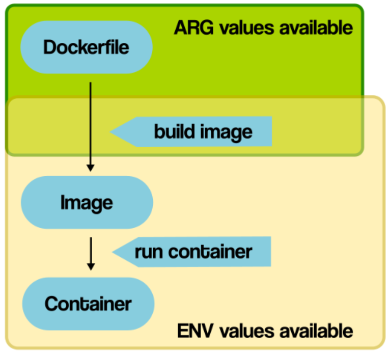

# Docker images

## 1.基本操作
### 拉取镜像

```bash
# 默认拉取最新版本
docker image pull nginx

# 指定版本号拉取，image指令可忽略
docker pull nginx:1.20.0
```

### 查看镜像

```bash
docker image ls

# 显示特定镜像的详细信息
docker image inspect `hash`
```

### 镜像的删除

```bash
docker image rm `hash 或者 name：tag`

# 不能删除已经搭建容器的镜像
# 必须先删除使用该镜像的容器之后，再删除镜像
```

### 镜像的导出

```bash
# 此命令会导出镜像并存放在当前目录下
docker image save nginx:1.20.0 -o nginx.image
```

### 查看镜像历史

```bash
docker image history `hash`
```


### 镜像的导入

```bash
# 导入本地镜像（离线）
docker image load -i ./nginx.image
```

### 通过 Dockerfile 构建镜像

 

```bash
# 本地存放 hello.py 和 Dockerfile 文件

# 执行构建命令:在当前./目录，构建tag(hello:1.0)
docker image build -t hello:1.0 ./

```

Dockerfile:

```dockerfile
FROM ubuntu:21.04
RUN apt-get update && \
    DEBIAN_FRONTEND=noninteractive apt-get install --no-install-recommends -y python3.9 python3-pip python3.9-dev
ADD hello.py /
CMD ["python3", "/hello.py"]
```

### 推送镜像到DockerHub

首先需要将镜像命名为`用户名/版本号`形式

```bash
#先登录DockerHub
docker login

docker image tag hello cxxvcheng/nginx:1.0.0
```

### 从DockerHub拉取镜像

```bash
docker image pull cxxvcheng/nginx:1.0.0
```

### 保存容器成为镜像

```bash
docker container commit `hash` cxxvcheng/nginx:1.0.1
```


## 2.Dockerfile

- Dockerfile是用于构建docker镜像的文件
- Dockerfile里包含了构建镜像所需的“指令”
- Dockerfile有其特定的语法规则

### 基础镜像源的选择（FROM)

- 固定版本tag
- 开源镜像（官方镜像最优）
- 尽量选择体积小的镜像

### 通过RUN执行指令

每执行一次RUN就会在docker里进行一次分层

所以需要将执行的指令进行拼接

### 文件复制COPY\ADD

往镜像里复制文件有两种方法`COPY`和`ADD`

`COPY`和`ADD`都可以把local的一个文件复制到镜像里,如果目标目录不存在,则**会自动创建**

`ADD`比`COPY`高级一点的地方就是,如果复制的是一个gzip等压缩文件时,**ADD会帮助我们自动去解压缩文件**

因此在 `COPY` 和 `ADD` 指令中选择的时候，可以遵循这样的原则，**所有的文件复制均使用 `COPY` 指令，仅在需要自动解压缩的场合使用 `ADD`**。

### 自动创建并切换到工作目录WORKDIR

```dockerfile
WORKDIR /app/bin
```

### 构建参数ARG和环境变量ENV

`ARG`和`ENV`



ARG(作用在Build镜像时)

```dockerfile
FROM ubuntu:21.04
ARG VERSION=2.0.1
RUN apt-get update && \
    apt-get install -y wget && \
    wget https://github.com/ipinfo/cli/releases/download/ipinfo-${VERSION}/ipinfo_${VERSION}_linux_amd64.tar.gz && \
    tar zxf ipinfo_${VERSION}_linux_amd64.tar.gz && \
    mv ipinfo_${VERSION}_linux_amd64 /usr/bin/ipinfo && \
    rm -rf ipinfo_${VERSION}_linux_amd64.tar.gz
```

ARG 可以在镜像build的时候**动态修改value**, 通过 `--build-arg`

```
docker image build -f .\Dockerfile-arg -t ipinfo-arg-2.0.0 --build-arg VERSION=2.0.0 .
```

ENV(可以作用在创建容器时)

```dockerfile
FROM ubuntu:21.04
ENV VERSION=2.0.1
RUN apt-get update && \
    apt-get install -y wget && \
    wget https://github.com/ipinfo/cli/releases/download/ipinfo-${VERSION}/ipinfo_${VERSION}_linux_amd64.tar.gz && \
    tar zxf ipinfo_${VERSION}_linux_amd64.tar.gz && \
    mv ipinfo_${VERSION}_linux_amd64 /usr/bin/ipinfo && \
    rm -rf ipinfo_${VERSION}_linux_amd64.tar.gz
```

ENV设置的变量可以在Image中保持，并在container容器中的环境变量里

```bash
> env  # 可以查看到在Dockerfile中定义的ENV
```

### CMD容器启动命令

CMD可以用来设置容器启动时默认会执行的命令。

- 容器启动时默认执行的命令
- 如果docker container run启动容器时指定了其它命令，则CMD命令会被忽略
- 如果定义了多个CMD，只有最后一个会被执行。

### 容器启动命令 ENTRYPOINT

ENTRYPOINT 也可以设置容器启动时要执行的命令，但是和CMD是有区别的。

- `CMD` 设置的命令，可以在docker container run 时传入其它命令，覆盖掉 `CMD` 的命令，但是 `ENTRYPOINT` 所设置的命令是一定会被执行的。
- `ENTRYPOINT` 和 `CMD` 可以联合使用，`ENTRYPOINT` 设置执行的命令，CMD传递参数

`CMD`和`ENTRYPOINT`同时支持shell格式和Exec格式。

Shell格式

```dockerfile
CMD echo 'hello docker'
```

```dockerfile
ENTRYPOINT echo 'hello docker'
```

Exec格式

```dockerfile
CMD ["echo", "hello docker"]
```

```dockerfile
ENTRYPOINT ["echo", "hello docker"]
```

Exec以shell脚本的方式执行

```dockerfile
FROM ubuntu:21.04
ENV NAME=docker
CMD ["sh", "-c", "echo hello $NAME"]
```

等同于

```dockerfile
FROM ubuntu:21.04
ENV NAME=docker
CMD echo "hello $NAME"
```

### 技巧

1. 需要经常发生改变的内容放到后面可以利用docker缓存加速镜像构建

2. 使用`.dockerignore`文件忽略目录下不需要传递给docker构建的内容。文件格式与`.gitignore`相同。

3. 尽量使用非root用户

    [Dockerfile 技巧——尽量使用非root用户 — Docker Tips 0.1 documentation](https://dockertips.readthedocs.io/en/latest/best-practise/no-root.html)

## Dockerfile多阶段构建

```dockerfile
FROM gcc:9.4 AS builder

COPY hello.c /src/hello.c

WORKDIR /src

RUN gcc --static -o hello hello.c


FROM alpine:3.13.5

COPY --from=builder /src/hello /src/hello

ENTRYPOINT [ "/src/hello" ]

CMD []
```

