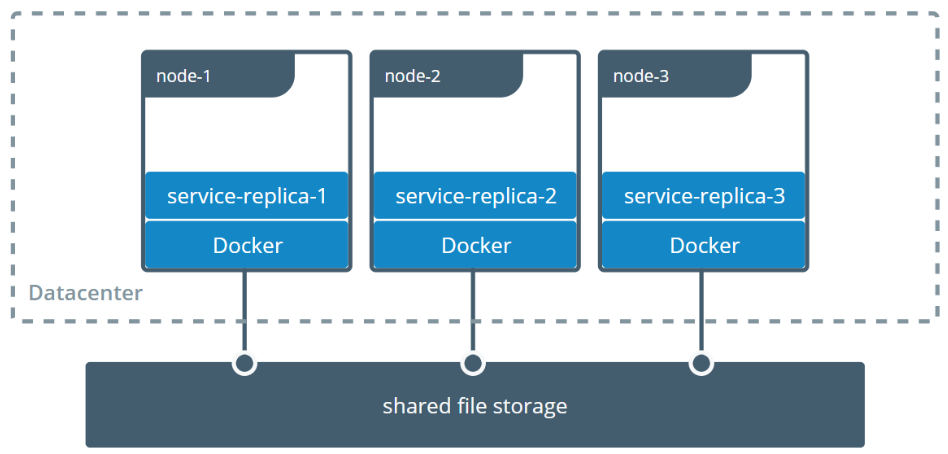

# Docker 映射卷

## Dockerfile

```dockerfile
FROM alpine:latest
RUN apk update
RUN apk --no-cache add curl
ENV SUPERCRONIC_URL=https://github.com/aptible/supercronic/releases/download/v0.1.12/supercronic-linux-amd64 \
    SUPERCRONIC=supercronic-linux-amd64 \
    SUPERCRONIC_SHA1SUM=048b95b48b708983effb2e5c935a1ef8483d9e3e
RUN curl -fsSLO "$SUPERCRONIC_URL" \
    && echo "${SUPERCRONIC_SHA1SUM}  ${SUPERCRONIC}" | sha1sum -c - \
    && chmod +x "$SUPERCRONIC" \
    && mv "$SUPERCRONIC" "/usr/local/bin/${SUPERCRONIC}" \
    && ln -s "/usr/local/bin/${SUPERCRONIC}" /usr/local/bin/supercronic
COPY my-cron /app/my-cron
WORKDIR /app

# 映射卷
VOLUME ["/app"]

# RUN cron job
CMD ["/usr/local/bin/supercronic", "/app/my-cron"]
```

```shell
my-cron

*/1 * * * * date >> /app/test.txt
```

### 创建容器时指定volume名字

```bash
# -v dirName:volumeName
docker container run -d -v cron-data:/app my-cron
```


## docker volume 命令

### 查看volume list

```bash
docker volume ls
```

### 删除全部volume

```bash
docker volume prune
```

### 查看volume详细情况（位置）

```bash
docker volume inspect `dirName||volumeHash`
```

### 创建容器时直接映射目录

```powershell
# Windows需要在docker软件中先提前设置好文件映射目录
docker container run -d -v ${pwd}:/app my-cron
```

```shell
# Linux或者Mac可以直接使用命令，注意pwd为小括号
docker container run -d -v $(pwd):/app my-cron
```

## 远程挂载目录

### 多个机器之间的容器共享数据



官方参考链接 https://docs.docker.com/storage/volumes/#share-data-among-machines

Docker的volume支持多种driver。默认创建的volume driver都是local

```
$ docker volume inspect vscode
[
    {
        "CreatedAt": "2021-06-23T21:33:57Z",
        "Driver": "local",
        "Labels": null,
        "Mountpoint": "/var/lib/docker/volumes/vscode/_data",
        "Name": "vscode",
        "Options": null,
        "Scope": "local"
    }
]
```

这一节我们看看一个叫sshfs的driver，如何让docker使用不在同一台机器上的文件系统做volume

### 环境准备

准备三台Linux机器，之间可以通过SSH相互通信。

| hostname     | ip             | ssh username | ssh password |
| ------------ | -------------- | ------------ | ------------ |
| docker-host1 | 192.168.200.10 | vagrant      | vagrant      |
| docker-host2 | 192.168.200.11 | vagrant      | vagrant      |
| docker-host3 | 192.168.200.12 | vagrant      | vagrant      |

### 安装plugin

在其中两台机器上安装一个plugin `vieux/sshfs`

```
[vagrant@docker-host1 ~]$ docker plugin install --grant-all-permissions vieux/sshfs
latest: Pulling from vieux/sshfs
Digest: sha256:1d3c3e42c12138da5ef7873b97f7f32cf99fb6edde75fa4f0bcf9ed277855811
52d435ada6a4: Complete
Installed plugin vieux/sshfs
[vagrant@docker-host2 ~]$ docker plugin install --grant-all-permissions vieux/sshfs
latest: Pulling from vieux/sshfs
Digest: sha256:1d3c3e42c12138da5ef7873b97f7f32cf99fb6edde75fa4f0bcf9ed277855811
52d435ada6a4: Complete
Installed plugin vieux/sshfs
```

### 创建volume

```
[vagrant@docker-host1 ~]$ docker volume create --driver vieux/sshfs \
                          -o sshcmd=vagrant@192.168.200.12:/home/vagrant \
                          -o password=vagrant \
                          sshvolume
```

查看

```
[vagrant@docker-host1 ~]$ docker volume ls
DRIVER               VOLUME NAME
vieux/sshfs:latest   sshvolume
[vagrant@docker-host1 ~]$ docker volume inspect sshvolume
[
    {
        "CreatedAt": "0001-01-01T00:00:00Z",
        "Driver": "vieux/sshfs:latest",
        "Labels": {},
        "Mountpoint": "/mnt/volumes/f59e848643f73d73a21b881486d55b33",
        "Name": "sshvolume",
        "Options": {
            "password": "vagrant",
            "sshcmd": "vagrant@192.168.200.12:/home/vagrant"
        },
        "Scope": "local"
    }
]
```

### 创建容器挂载Volume

创建容器，挂载sshvolume到/app目录，然后进入容器的shell，在/app目录创建一个test.txt文件

```
[vagrant@docker-host1 ~]$ docker run -it -v sshvolume:/app busybox sh
Unable to find image 'busybox:latest' locally
latest: Pulling from library/busybox
b71f96345d44: Pull complete
Digest: sha256:930490f97e5b921535c153e0e7110d251134cc4b72bbb8133c6a5065cc68580d
Status: Downloaded newer image for busybox:latest
/ #
/ # ls
app   bin   dev   etc   home  proc  root  sys   tmp   usr   var
/ # cd /app
/app # ls
/app # echo "this is ssh volume"> test.txt
/app # ls
test.txt
/app # more test.txt
this is ssh volume
/app #
/app #
```

这个文件我们可以在docker-host3上看到

```
[vagrant@docker-host3 ~]$ pwd
/home/vagrant
[vagrant@docker-host3 ~]$ ls
test.txt
[vagrant@docker-host3 ~]$ more test.txt
this is ssh volume
```