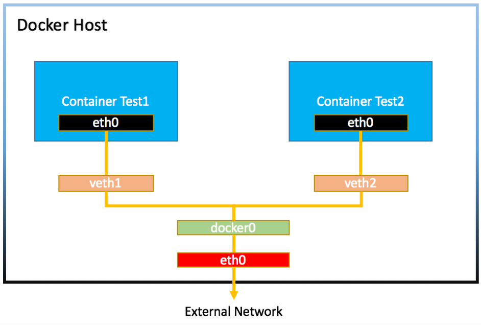
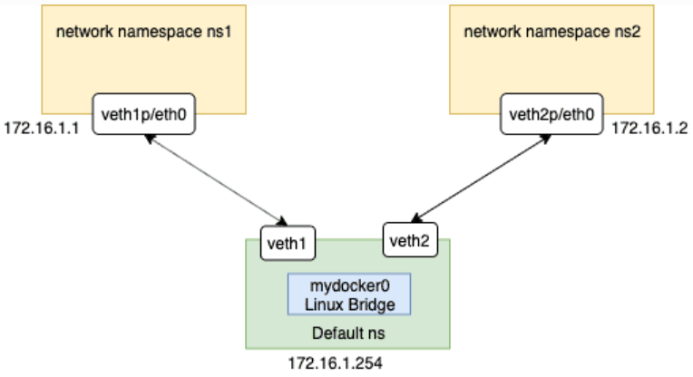

# Docker网络

## 网络的常用命令

### IP地址的查看

Windows

```
ipconfig
```

Linux

```
ifconfig
```

或者

```
ip addr
```

### 网络连通性测试

#### ping命令

```
PS C:\Users\Peng Xiao> ping 192.168.178.1

Pinging 192.168.178.1 with 32 bytes of data:
Reply from 192.168.178.1: bytes=32 time=2ms TTL=64
Reply from 192.168.178.1: bytes=32 time=3ms TTL=64
Reply from 192.168.178.1: bytes=32 time=3ms TTL=64
Reply from 192.168.178.1: bytes=32 time=3ms TTL=64

Ping statistics for 192.168.178.1:
    Packets: Sent = 4, Received = 4, Lost = 0 (0% loss),
Approximate round trip times in milli-seconds:
    Minimum = 2ms, Maximum = 3ms, Average = 2ms
PS C:\Users\Peng Xiao>
```

#### telnet命令

测试端口的连通性

```
➜  ~ telnet www.baidu.com 80
Trying 104.193.88.123...
Connected to www.wshifen.com.
Escape character is '^]'.

HTTP/1.1 400 Bad Request

Connection closed by foreign host.
➜  ~
```

#### traceroute

路径探测跟踪

Linux下使用 `tracepath`

```
➜  ~ tracepath www.baidu.com
1?: [LOCALHOST]                      pmtu 1500
1:  DESKTOP-FQ0EO8J                                       0.430ms
1:  DESKTOP-FQ0EO8J                                       0.188ms
2:  192.168.178.1                                         3.371ms
3:  no reply
4:  gv-rc0052-cr102-et91-251.core.as33915.net            13.970ms
5:  asd-tr0021-cr101-be156-10.core.as9143.net            19.190ms
6:  nl-ams04a-ri3-ae51-0.core.as9143.net                213.589ms
7:  63.218.65.33                                         16.887ms
8:  HundredGE0-6-0-0.br04.sjo01.pccwbtn.net             176.099ms asymm 10
9:  HundredGE0-6-0-0.br04.sjo01.pccwbtn.net             173.399ms asymm 10
10:  63-219-23-98.static.pccwglobal.net                  177.337ms asymm 11
11:  104.193.88.13                                       178.197ms asymm 12
12:  no reply
13:  no reply
14:  no reply
15:  no reply
    Too many hops: pmtu 1500
    Resume: pmtu 1500
➜  ~
```

Windows下使用 `TRACERT.EXE`

```
PS C:\Users\Peng Xiao> TRACERT.EXE www.baidu.com

Tracing route to www.wshifen.com [104.193.88.123]
over a maximum of 30 hops:

1     4 ms     3 ms     3 ms  192.168.178.1
2     *        *        *     Request timed out.
3    21 ms    18 ms    19 ms  gv-rc0052-cr102-et91-251.core.as33915.net [213.51.197.37]
4    14 ms    13 ms    12 ms  asd-tr0021-cr101-be156-10.core.as9143.net [213.51.158.2]
5    23 ms    19 ms    14 ms  nl-ams04a-ri3-ae51-0.core.as9143.net [213.51.64.194]
6    15 ms    14 ms    13 ms  63.218.65.33
7   172 ms   169 ms   167 ms  HundredGE0-6-0-0.br04.sjo01.pccwbtn.net [63.223.60.58]
8   167 ms   168 ms   168 ms  HundredGE0-6-0-0.br04.sjo01.pccwbtn.net [63.223.60.58]
9   168 ms   173 ms   167 ms  63-219-23-98.static.pccwglobal.net [63.219.23.98]
10   172 ms   170 ms   171 ms
```

### curl命令

请求web服务的

http://www.ruanyifeng.com/blog/2019/09/curl-reference.html

## Docker bridge网络



### 创建两个容器

```
$ docker container run -d --rm --name box1 busybox /bin/sh -c "while true; do sleep 3600; done"
$ docker container run -d --rm --name box2 busybox /bin/sh -c "while true; do sleep 3600; done"
$ docker container ls
CONTAINER ID   IMAGE     COMMAND                  CREATED          STATUS          PORTS     NAMES
4f3303c84e53   busybox   "/bin/sh -c 'while t…"   49 minutes ago   Up 49 minutes             box2
03494b034694   busybox   "/bin/sh -c 'while t…"   49 minutes ago   Up 49 minutes             box1
```

### 容器间通信

两个容器都连接到了一个叫 docker0 的Linux bridge上

```
$ docker network ls
NETWORK ID     NAME      DRIVER    SCOPE
1847e179a316   bridge    bridge    local
a647a4ad0b4f   host      host      local
fbd81b56c009   none      null      local
$ docker network inspect bridge
[
    {
        "Name": "bridge",
        "Id": "1847e179a316ee5219c951c2c21cf2c787d431d1ffb3ef621b8f0d1edd197b24",
        "Created": "2021-07-01T15:28:09.265408946Z",
        "Scope": "local",
        "Driver": "bridge",
        "EnableIPv6": false,
        "IPAM": {
            "Driver": "default",
            "Options": null,
            "Config": [
                {
                    "Subnet": "172.17.0.0/16",
                    "Gateway": "172.17.0.1"
                }
            ]
        },
        "Internal": false,
        "Attachable": false,
        "Ingress": false,
        "ConfigFrom": {
            "Network": ""
        },
        "ConfigOnly": false,
        "Containers": {
            "03494b034694982fa085cc4052b6c7b8b9c046f9d5f85f30e3a9e716fad20741": {
                "Name": "box1",
                "EndpointID": "072160448becebb7c9c333dce9bbdf7601a92b1d3e7a5820b8b35976cf4fd6ff",
                "MacAddress": "02:42:ac:11:00:02",
                "IPv4Address": "172.17.0.2/16",
                "IPv6Address": ""
            },
            "4f3303c84e5391ea37db664fd08683b01decdadae636aaa1bfd7bb9669cbd8de": {
                "Name": "box2",
                "EndpointID": "4cf0f635d4273066acd3075ec775e6fa405034f94b88c1bcacdaae847612f2c5",
                "MacAddress": "02:42:ac:11:00:03",
                "IPv4Address": "172.17.0.3/16",
                "IPv6Address": ""
            }
        },
        "Options": {
            "com.docker.network.bridge.default_bridge": "true",
            "com.docker.network.bridge.enable_icc": "true",
            "com.docker.network.bridge.enable_ip_masquerade": "true",
            "com.docker.network.bridge.host_binding_ipv4": "0.0.0.0",
            "com.docker.network.bridge.name": "docker0",
            "com.docker.network.driver.mtu": "1500"
        },
        "Labels": {}
    }
]
```

Note

```
`brctl` 使用前需要安装, 对于CentOS, 可以通过 `sudo yum install -y bridge-utils` 安装. 对于Ubuntu, 可以通过 `sudo apt-get install -y bridge-utils
$ brctl show
bridge name     bridge id               STP enabled     interfaces
docker0         8000.0242759468cf       no              veth8c9bb82
                                                        vethd8f9afb
```

### 容器对外通信

查看路由

```
$ ip route
default via 10.0.2.2 dev eth0 proto dhcp metric 100
10.0.2.0/24 dev eth0 proto kernel scope link src 10.0.2.15 metric 100
172.17.0.0/16 dev docker0 proto kernel scope link src 172.17.0.1
192.168.200.0/24 dev eth1 proto kernel scope link src 192.168.200.10 metric 101
```

iptable 转发规则

```
$ sudo iptables --list -t nat
Chain PREROUTING (policy ACCEPT)
target     prot opt source               destination
DOCKER     all  --  anywhere             anywhere             ADDRTYPE match dst-type LOCAL

Chain INPUT (policy ACCEPT)
target     prot opt source               destination

Chain OUTPUT (policy ACCEPT)
target     prot opt source               destination
DOCKER     all  --  anywhere            !loopback/8           ADDRTYPE match dst-type LOCAL

Chain POSTROUTING (policy ACCEPT)
target     prot opt source               destination
MASQUERADE  all  --  172.17.0.0/16        anywhere

Chain DOCKER (2 references)
target     prot opt source               destination
RETURN     all  --  anywhere             anywhere
```

### 端口转发

创建容器

```
$ docker container run -d --rm --name web -p 8080:80 nginx
$ docker container inspect --format '{{.NetworkSettings.IPAddress}}' web
$ docker container run -d --rm --name client busybox /bin/sh -c "while true; do sleep 3600; done"
$ docker container inspect --format '{{.NetworkSettings.IPAddress}}' client
$ docker container exec -it client wget http://172.17.0.2
```

查看iptables的端口转发规则

```
[vagrant@docker-host1 ~]$ sudo iptables -t nat -nvxL
Chain PREROUTING (policy ACCEPT 10 packets, 1961 bytes)
    pkts      bytes target     prot opt in     out     source               destination
    1       52 DOCKER     all  --  *      *       0.0.0.0/0            0.0.0.0/0            ADDRTYPE match dst-type LOCAL

Chain INPUT (policy ACCEPT 9 packets, 1901 bytes)
    pkts      bytes target     prot opt in     out     source               destination

Chain OUTPUT (policy ACCEPT 2 packets, 120 bytes)
    pkts      bytes target     prot opt in     out     source               destination
    0        0 DOCKER     all  --  *      *       0.0.0.0/0           !127.0.0.0/8          ADDRTYPE match dst-type LOCAL

Chain POSTROUTING (policy ACCEPT 4 packets, 232 bytes)
    pkts      bytes target     prot opt in     out     source               destination
    3      202 MASQUERADE  all  --  *      !docker0  172.17.0.0/16        0.0.0.0/0
    0        0 MASQUERADE  tcp  --  *      *       172.17.0.2           172.17.0.2           tcp dpt:80

Chain DOCKER (2 references)
    pkts      bytes target     prot opt in     out     source               destination
    0        0 RETURN     all  --  docker0 *       0.0.0.0/0            0.0.0.0/0
    1       52 DNAT       tcp  --  !docker0 *       0.0.0.0/0            0.0.0.0/0            tcp dpt:8080 to:172.17.0.2:80
```

### 参考资料

    https://access.redhat.com/documentation/en-US/Red_Hat_Enterprise_Linux/4/html/Security_Guide/s1-firewall-ipt-fwd.html

### 创建自己的Docker bridge

```bash
# 创建bridge
docker network create -d bridge mybridge
# -d driver
# mybridge 网桥名称

# 列出docker网络
docker network ls

# 查看 mybridge 详情
docker network inspect mybridge
# 可以查看到子网和网关详情
# 可以通过一些参数进行创建时自定义修改

# 使用指定网络创建容器
docker container run -d --rm --name web-container --network mybridge -p 8080:80 nginx /bin/bash

# 查看刚创建的容器详情（包含网络）
docker container inspect web-container

# 进入容器查看网络
docker exec -it web-container /bin/bash
ip a

```

断开web-container的bridge

```bash
# 断开bridge，只剩下mybridge
docker network disconnect bridge web-container

# 查看
docker container inspect web-container
```

容器之间可以相互ping

```bash
# 由web-container1 ping 到 web-container2
docker container exec -it web-container1 ping 172.18.0.2

# 由web-container1 通过name ping 到 web-container2
docker container exec -it web-container1 ping web-container2
# 证明自定义的docker bridge （mybridge）可提供本地DNS的功能

# 但是默认的docker bridge 无法相互ping 不提供本地DNS工作

```

因此**建议使用自定义的docker bridge**

网络创建帮助

```bash
docker bridge create --help
```

端口转发

```bash
# -p 端口转发 local机(外部端口):docker机(内部端口)
docker container run -d --rm --name web-container --network mybridge -p 8080:80 nginx /bin/bash
```

查看详细内容中的IP

```bash
# 启动容器服务
docker container run -d --name web-container -p 8080:80 nginx

# 查看IP
docker container inspect --format '{{.NetworkSettings.IPAddress}}' web-container

# docker容器内部查看iptables关于端口地址转发的细节
sudo iptables -t nat -nvxL
```

Dockerfile中定义的`EXPOSE`中的端口不影响`-p`选项，它的作用是解释说明

## host网络 详解

指定使用host

```bash
# 使用--network host 指定使用host网络
docker container run -d --rm --name box2 --network host busybox /bin/sh -c "while true; do sleep 3600; done"
```

Docker container**和主机共享同一个网络**——host网络，不会多一步端口转发导致的性能损失。

主机是用什么配置，容器就使用相同的配置，容器的服务端口会直接在主机上使用

无法使用host网络，创建相同的已被占用的暴露的端口的容器，这会报错导致容器退出。

```bash
# 上述报错退出可使用以下命令查看容器
docker logs -f web5
```

## null 网络

使用此网络创建的容器不会通过网络和外界交互。


---
## 网络命名空间(网络隔离技术)

description: 仅供演示便于理解Docker网络

Linux的Namespace（命名空间）技术是一种隔离技术，常用的Namespace有 user namespace, process namespace, network namespace等

在Docker容器中，不同的容器通过Network namespace进行了隔离，也就是不同的容器有各自的IP地址，路由表等，互不影响。

Note

准备一台Linux机器，这一节会用到一个叫 `brtcl` 的命令，这个命令需要安装，如果是Ubuntu的系统，可以通过 `apt-get install bridge-utils` 安装；如果是Centos系统，可以通过 `sudo yum install bridge-utils` 来安装



### 创建bridge

```
[vagrant@docker-host1 ~]$ sudo brctl addbr mydocker0
[vagrant@docker-host1 ~]$ brctl show
bridge name     bridge id               STP enabled     interfaces
mydocker0               8000.000000000000       no
```

### 准备一个shell脚本

脚本名字叫 `add-ns-to-br.sh`

```shell
#!/bin/bash

# 定义传入的三个变量
# 第一个 bridge name
bridge=$1
# 需要操作的域名
namespace=$2
# 网址
addr=$3

# 虚拟网卡名
vethA=veth-$namespace
vethB=eth00

# 创建网络名
sudo ip netns add $namespace
# 创建网卡链接
sudo ip link add $vethA type veth peer name $vethB

# 将网卡B放入域名空间
sudo ip link set $vethB netns $namespace
# 将网址分配给网卡B
sudo ip netns exec $namespace ip addr add $addr dev $vethB
# 让域名空间的连接启动
sudo ip netns exec $namespace ip link set $vethB up

# 让网卡A启动
sudo ip link set $vethA up

# 启动bridge
sudo brctl addif $bridge $vethA
```

### 脚本执行

```bash
sh add-ns-to-br.sh mydocker0 ns1 172.16.1.1/16
sh add-ns-to-br.sh mydocker0 ns2 172.16.1.2/16
```

把mydocker0这个bridge up起来

```bash
sudo ip link set dev mydocker0 up
```

### 验证

```
[vagrant@docker-host1 ~]$ sudo ip netns exec ns1 bash
[root@docker-host1 vagrant]# ip a
1: lo: <LOOPBACK> mtu 65536 qdisc noop state DOWN group default qlen 1000
    link/loopback 00:00:00:00:00:00 brd 00:00:00:00:00:00
5: eth00@if6: <BROADCAST,MULTICAST,UP,LOWER_UP> mtu 1500 qdisc noqueue state UP group default qlen 1000
    link/ether f2:59:19:34:73:70 brd ff:ff:ff:ff:ff:ff link-netnsid 0
    inet 172.16.1.1/16 scope global eth00
    valid_lft forever preferred_lft forever
    inet6 fe80::f059:19ff:fe34:7370/64 scope link
    valid_lft forever preferred_lft forever
[root@docker-host1 vagrant]# ping 172.16.1.2
PING 172.16.1.2 (172.16.1.2) 56(84) bytes of data.
64 bytes from 172.16.1.2: icmp_seq=1 ttl=64 time=0.029 ms
64 bytes from 172.16.1.2: icmp_seq=2 ttl=64 time=0.080 ms
^C
--- 172.16.1.2 ping statistics ---
2 packets transmitted, 2 received, 0% packet loss, time 1000ms
rtt min/avg/max/mdev = 0.029/0.054/0.080/0.026 ms
[root@docker-host1 vagrant]#
```

### 对外通信

https://www.karlrupp.net/en/computer/nat_tutorial
