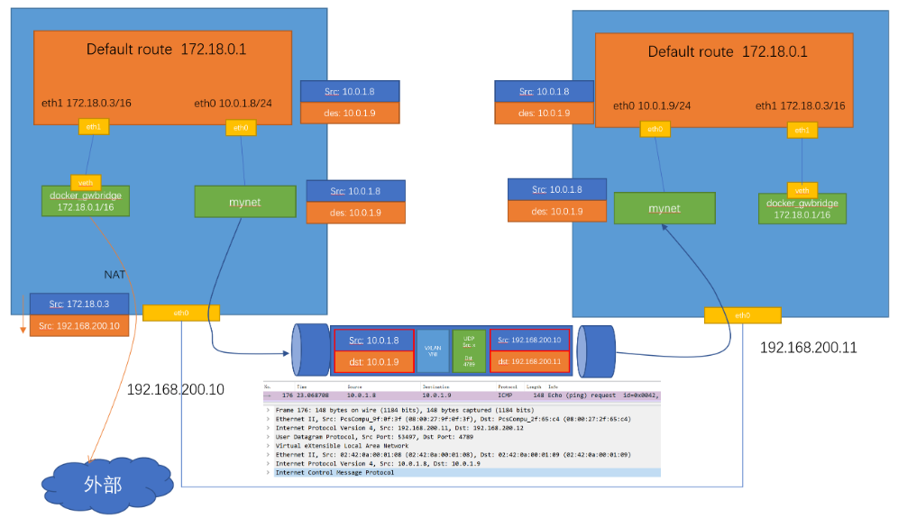
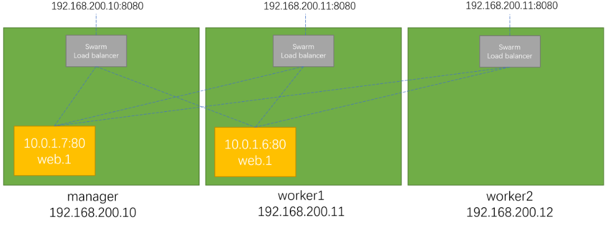
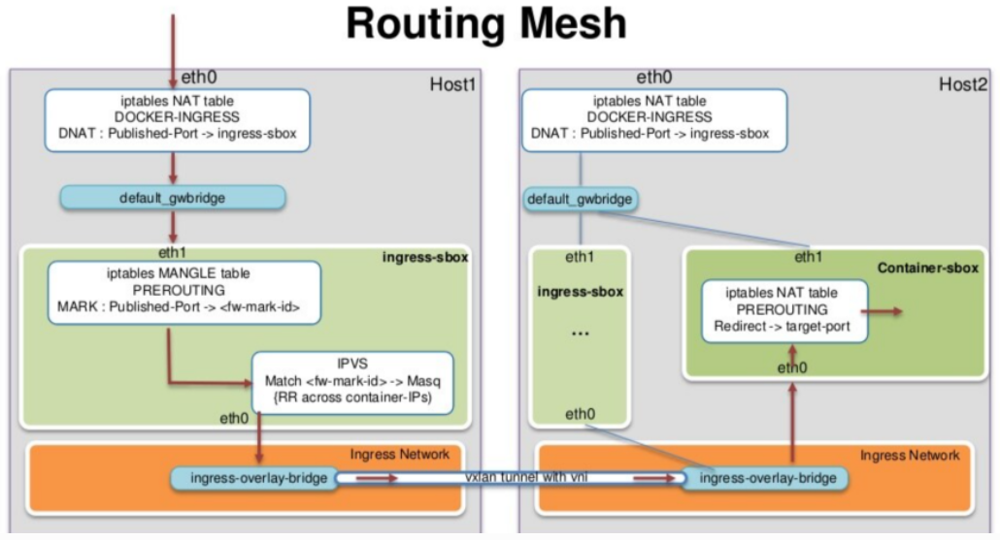

# SWARM 容器编排

## 单节点环境

### 初始化

`docker info` 这个命令可以查看我们的docker engine有没有激活swarm模式， 默认是没有的，我们会看到

```
Swarm: inactive
```

激活swarm，有两个方法：

- 初始化一个swarm集群，自己成为manager
- 加入一个已经存在的swarm集群

```bash
# 初始化
$ docker swarm init

Swarm initialized: current node (vjtstrkxntsacyjtvl18hcbe4) is now a manager.

To add a worker to this swarm, run the following command:

    docker swarm join --token SWMTKN-1-33ci17l1n34fh6v4r1qq8qmocjo347saeuer2xrxflrn25jgjx-7vphgu8a0gsa4anof6ffrgwqb 192.168.65.3:2377

To add a manager to this swarm, run 'docker swarm join-token manager' and follow the instructions.


$ docker node ls

ID                            HOSTNAME         STATUS    AVAILABILITY   MANAGER STATUS   ENGINE VERSION
vjtstrkxntsacyjtvl18hcbe4 *   docker-desktop   Ready     Active         Leader           20.10.7

```

```bash
# 退出Swarm集群(单节点)
docker swarm leave --force
```

### docker swarm init 背后发生了什么

主要是PKI和安全相关的自动化

- 创建swarm集群的根证书
- manager节点的证书
- 其它节点加入集群需要的tokens

创建Raft数据库用于存储证书，配置，密码等数据

RAFT相关资料

- https://raft.github.io/
- https://docs.docker.com/engine/swarm/raft/

看动画学会 Raft 算法

[看动画轻松学会 Raft 算法 - -Finley- - 博客园 (cnblogs.com)](https://www.cnblogs.com/Finley/p/14467602.html)

[Raft (thesecretlivesofdata.com)](http://thesecretlivesofdata.com/raft/)

## 3个nginx

```bash
docker swarm init

docker node ls

docker service create nginx:latest

docker service ls

docker service ps `hash`

docker container ls

# 复制3个服务
docker service update `hash` --replicas 3

docker service ps `hash`

docker container ls

# 移除里面的某个容器后，swarm会自动再次创建新的容器补充进去

# 停止swarm服务
docker service rm `hash`
```

## Swarm 的 overlay 网络详解

对于理解swarm的网络来讲，最重要的两个点：

- 第一是外部如何访问部署运行在swarm集群内的服务，可以称之为 `入方向` 流量，在swarm里我们通过 `ingress` 来解决
- 第二是部署在swarm集群里的服务，如何对外进行访问，这部分又分为两块:
    - 第一，`东西向流量` ，也就是不同swarm节点上的容器之间如何通信，swarm通过 `overlay` 网络来解决；
    - 第二，`南北向流量` ，也就是swarm集群里的容器如何对外访问，比如互联网，这个是 `Linux bridge + iptables NAT` 来解决的

### 创建 overlay 网络

```
vagrant@swarm-manager:~$ docker network create -d overlay mynet
```

这个网络会同步到所有的swarm节点上

### 创建服务

创建一个服务连接到这个 overlay网络， name 是 test ， replicas 是 2

```
vagrant@swarm-manager:~$ docker service create --network mynet --name test --replicas 2 busybox ping 8.8.8.8
vagrant@swarm-manager:~$ docker service ps test
ID             NAME      IMAGE            NODE            DESIRED STATE   CURRENT STATE            ERROR     PORTS
yf5uqm1kzx6d   test.1    busybox:latest   swarm-worker1   Running         Running 18 seconds ago
3tmp4cdqfs8a   test.2    busybox:latest   swarm-worker2   Running         Running 18 seconds ago
```

可以看到这两个容器分别被创建在worker1和worker2两个节点上

### 网络查看

到worker1和worker2上分别查看容器的网络连接情况

```
vagrant@swarm-worker1:~$ docker container ls
CONTAINER ID   IMAGE            COMMAND          CREATED      STATUS      PORTS     NAMES
cac4be28ced7   busybox:latest   "ping 8.8.8.8"   2 days ago   Up 2 days             test.1.yf5uqm1kzx6dbt7n26e4akhsu
vagrant@swarm-worker1:~$ docker container exec -it cac sh
/ # ip a
1: lo: <LOOPBACK,UP,LOWER_UP> mtu 65536 qdisc noqueue qlen 1000
    link/loopback 00:00:00:00:00:00 brd 00:00:00:00:00:00
    inet 127.0.0.1/8 scope host lo
    valid_lft forever preferred_lft forever
24: eth0@if25: <BROADCAST,MULTICAST,UP,LOWER_UP,M-DOWN> mtu 1450 qdisc noqueue
    link/ether 02:42:0a:00:01:08 brd ff:ff:ff:ff:ff:ff
    inet 10.0.1.8/24 brd 10.0.1.255 scope global eth0
    valid_lft forever preferred_lft forever
26: eth1@if27: <BROADCAST,MULTICAST,UP,LOWER_UP,M-DOWN> mtu 1500 qdisc noqueue
    link/ether 02:42:ac:12:00:03 brd ff:ff:ff:ff:ff:ff
    inet 172.18.0.3/16 brd 172.18.255.255 scope global eth1
    valid_lft forever preferred_lft forever
/ #
```

这个容器有两个接口 eth0和eth1， 其中eth0是连到了mynet这个网络，eth1是连到docker_gwbridge这个网络

```
vagrant@swarm-worker1:~$ docker network ls
NETWORK ID     NAME              DRIVER    SCOPE
a631a4e0b63c   bridge            bridge    local
56945463a582   docker_gwbridge   bridge    local
9bdfcae84f94   host              host      local
14fy2l7a4mci   ingress           overlay   swarm
lpirdge00y3j   mynet             overlay   swarm
c1837f1284f8   none              null      local
```

在这个容器里是可以直接ping通worker2上容器的IP 10.0.1.9的



## Swarm 的 ingress网络

来源：[Swarm 的 ingress网络 — Docker Tips 0.1 documentation](https://dockertips.readthedocs.io/en/latest/docker-swarm/ingress-network.html)

docker swarm的ingress网络又叫 `Ingress Routing Mesh`

主要是为了实现把service的服务端口对外发布出去，让其能够被外部网络访问到。

ingress routing mesh是docker swarm网络里最复杂的一部分内容，包括多方面的内容：

- iptables的 Destination NAT流量转发
- Linux bridge, network namespace
- 使用IPVS技术做负载均衡
- 包括容器间的通信（overlay）和入方向流量的端口转发

### service创建


创建一个service，指定网络是overlay的mynet， 通过-p把端口映射出来

我们使用的镜像 `containous/whoami` 是一个简单的web服务，能返回服务器的hostname，和基本的网络信息，比如IP地址

```
vagrant@swarm-manager:~$ docker service create --name web --network mynet -p 8080:80 --replicas 2 containous/whoami
a9cn3p0ovg5jcz30rzz89lyfz
overall progress: 2 out of 2 tasks
1/2: running   [==================================================>]
2/2: running   [==================================================>]
verify: Service converged
vagrant@swarm-manager:~$ docker service ls
ID             NAME      MODE         REPLICAS   IMAGE                      PORTS
a9cn3p0ovg5j   web       replicated   2/2        containous/whoami:latest   *:8080->80/tcp
vagrant@swarm-manager:~$ docker service ps web
ID             NAME      IMAGE                      NODE            DESIRED STATE   CURRENT STATE            ERROR     PORTS
udlzvsraha1x   web.1     containous/whoami:latest   swarm-worker1   Running         Running 16 seconds ago
mms2c65e5ygt   web.2     containous/whoami:latest   swarm-manager   Running         Running 16 seconds ago
vagrant@swarm-manager:~$
```

### service的访问

8080这个端口到底映射到哪里了？尝试三个swarm节点的IP加端口8080

可以看到三个节点IP都可以访问，并且回应的容器是不同的（hostname），也就是有负载均衡的效果

```
vagrant@swarm-manager:~$ curl 192.168.200.10:8080
Hostname: fdf7c1354507
IP: 127.0.0.1
IP: 10.0.0.7
IP: 172.18.0.3
IP: 10.0.1.14
RemoteAddr: 10.0.0.2:36828
GET / HTTP/1.1
Host: 192.168.200.10:8080
User-Agent: curl/7.68.0
Accept: */*

vagrant@swarm-manager:~$ curl 192.168.200.11:8080
Hostname: fdf7c1354507
IP: 127.0.0.1
IP: 10.0.0.7
IP: 172.18.0.3
IP: 10.0.1.14
RemoteAddr: 10.0.0.3:54212
GET / HTTP/1.1
Host: 192.168.200.11:8080
User-Agent: curl/7.68.0
Accept: */*

vagrant@swarm-manager:~$ curl 192.168.200.12:8080
Hostname: c83ee052787a
IP: 127.0.0.1
IP: 10.0.0.6
IP: 172.18.0.3
IP: 10.0.1.13
RemoteAddr: 10.0.0.4:49820
GET / HTTP/1.1
Host: 192.168.200.12:8080
User-Agent: curl/7.68.0
Accept: */*
```



### ingress 数据包的走向

以manager节点为例，数据到底是如何达到service的container的

```
vagrant@swarm-manager:~$ sudo iptables -nvL -t nat
Chain PREROUTING (policy ACCEPT 388 packets, 35780 bytes)
pkts bytes target     prot opt in     out     source               destination
296 17960 DOCKER-INGRESS  all  --  *      *       0.0.0.0/0            0.0.0.0/0            ADDRTYPE match dst-type LOCAL
21365 1282K DOCKER     all  --  *      *       0.0.0.0/0            0.0.0.0/0            ADDRTYPE match dst-type LOCAL

Chain INPUT (policy ACCEPT 388 packets, 35780 bytes)
pkts bytes target     prot opt in     out     source               destination

Chain OUTPUT (policy ACCEPT 340 packets, 20930 bytes)
pkts bytes target     prot opt in     out     source               destination
    8   590 DOCKER-INGRESS  all  --  *      *       0.0.0.0/0            0.0.0.0/0            ADDRTYPE match dst-type LOCAL
    1    60 DOCKER     all  --  *      *       0.0.0.0/0           !127.0.0.0/8          ADDRTYPE match dst-type LOCAL

Chain POSTROUTING (policy ACCEPT 340 packets, 20930 bytes)
pkts bytes target     prot opt in     out     source               destination
    2   120 MASQUERADE  all  --  *      docker_gwbridge  0.0.0.0/0            0.0.0.0/0            ADDRTYPE match src-type LOCAL
    3   252 MASQUERADE  all  --  *      !docker0  172.17.0.0/16        0.0.0.0/0
    0     0 MASQUERADE  all  --  *      !docker_gwbridge  172.18.0.0/16        0.0.0.0/0

Chain DOCKER (2 references)
pkts bytes target     prot opt in     out     source               destination
    0     0 RETURN     all  --  docker0 *       0.0.0.0/0            0.0.0.0/0
    0     0 RETURN     all  --  docker_gwbridge *       0.0.0.0/0            0.0.0.0/0

Chain DOCKER-INGRESS (2 references)
pkts bytes target     prot opt in     out     source               destination
    2   120 DNAT       tcp  --  *      *       0.0.0.0/0            0.0.0.0/0            tcp dpt:8080 to:172.18.0.2:8080
302 18430 RETURN     all  --  *      *       0.0.0.0/0            0.0.0.0/0
```

通过iptables，可以看到一条DNAT的规则，所有访问本地8080端口的流量都被转发到 172.18.0.2:8080

那这个172.18.0.2 是什么？

首先　172.18.0.0/16　这个网段是 `docker_gwbridge` 的，所以这个地址肯定是连在了 `docker_gwbridge` 上。

`docker network inspect docker_gwbridge` 可以看到这个网络连接了一个叫　`ingress-sbox`　的容器。它的地址就是　172.18.0.2/16

这个　`ingress-sbox`　其实并不是一个容器，而是一个网络的命名空间　network namespace,　我们可以通过下面的方式进入到这个命名空间

```
vagrant@swarm-manager:~$　docker run -it --rm -v /var/run/docker/netns:/netns --privileged=true nicolaka/netshoot nsenter --net=/netns/ingress_sbox sh
~ # ip a
1: lo: <LOOPBACK,UP,LOWER_UP> mtu 65536 qdisc noqueue state UNKNOWN group default qlen 1000
    link/loopback 00:00:00:00:00:00 brd 00:00:00:00:00:00
    inet 127.0.0.1/8 scope host lo
       valid_lft forever preferred_lft forever
8: eth0@if9: <BROADCAST,MULTICAST,UP,LOWER_UP> mtu 1450 qdisc noqueue state UP group default
    link/ether 02:42:0a:00:00:02 brd ff:ff:ff:ff:ff:ff link-netnsid 0
    inet 10.0.0.2/24 brd 10.0.0.255 scope global eth0
       valid_lft forever preferred_lft forever
    inet 10.0.0.5/32 scope global eth0
       valid_lft forever preferred_lft forever
10: eth1@if11: <BROADCAST,MULTICAST,UP,LOWER_UP> mtu 1500 qdisc noqueue state UP group default
    link/ether 02:42:ac:12:00:02 brd ff:ff:ff:ff:ff:ff link-netnsid 1
    inet 172.18.0.2/16 brd 172.18.255.255 scope global eth1
       valid_lft forever preferred_lft forever
```

通过查看地址，发现这个命名空间连接了两个网络，一个eth1是连接了　`docker_gwbridge`　，另外一个eth0连接了　`ingress` 这个网络。

```
~ # ip route
default via 172.18.0.1 dev eth1
10.0.0.0/24 dev eth0 proto kernel scope link src 10.0.0.2
172.18.0.0/16 dev eth1 proto kernel scope link src 172.18.0.2

~ # iptables -nvL -t mangle
Chain PREROUTING (policy ACCEPT 22 packets, 2084 bytes)
 pkts bytes target     prot opt in     out     source               destination
   12   806 MARK       tcp  --  *      *       0.0.0.0/0            0.0.0.0/0            tcp dpt:8080 MARK set 0x100

Chain INPUT (policy ACCEPT 14 packets, 1038 bytes)
 pkts bytes target     prot opt in     out     source               destination
    0     0 MARK       all  --  *      *       0.0.0.0/0            10.0.0.5             MARK set 0x100

Chain FORWARD (policy ACCEPT 8 packets, 1046 bytes)
 pkts bytes target     prot opt in     out     source               destination

Chain OUTPUT (policy ACCEPT 14 packets, 940 bytes)
 pkts bytes target     prot opt in     out     source               destination

Chain POSTROUTING (policy ACCEPT 22 packets, 1986 bytes)
 pkts bytes target     prot opt in     out     source               destination
~ # ipvsadm
IP Virtual Server version 1.2.1 (size=4096)
Prot LocalAddress:Port Scheduler Flags
  -> RemoteAddress:Port           Forward Weight ActiveConn InActConn
FWM  256 rr
  -> 10.0.0.6:0                   Masq    1      0          0
  -> 10.0.0.7:0                   Masq    1      0          0
~ #
```

通过ipvs做了负载均衡



关于这里的负载均衡

- 这是一个stateless load balancing
- 这是三层的负载均衡，不是四层的 LB is at OSI Layer 3 (TCP), not Layer 4 (DNS)
- 以上两个限制可以通过Nginx或者HAProxy LB proxy解决 （https://docs.docker.com/engine/swarm/ingress/）

之后的部分内容请参阅[内部负载均衡和 VIP — Docker Tips 0.1 documentation](https://dockertips.readthedocs.io/en/latest/docker-swarm/internal_lb.html)

