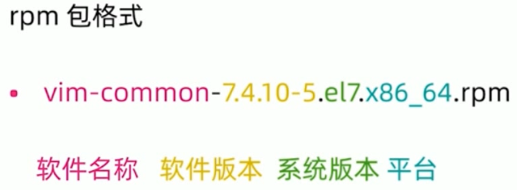

# Linxu基础

## 一、常见命令

### /根目录

/root root用户的家目录

/home/username普通用户的家目录

/etc配置文件目录

/bin命令目录

/sbin管理命令目录

/usr/bin/usr/sbin系统预装的其他命令

### 切换到root或者其他用户

su - root // 减号代表切换用户的同时切换用户家目录

### ls查看当前目录下的文件

【选项，选项…】参数…

常用参数：

-l长格式显示文件

-a显示隐藏文件

-r逆序显示

-t按照时间顺序显示

-R递归显示

-h 按照mb等文件尺寸显示文件大小

ls -l


### 清屏

clear 

或者

Ctrl + L

### 回到之前cd的目录

cd -

### 文件操作

mkdir -p 忽略新建文件夹时已存在文件夹的报错

rmdir

rm

cp -v -p  FILENAME ToPATH // -v 显示复制过程 -p 保留源文件信息（属主、创建时间等）

touch FLIENAME // 创建空文件

cp -a FILENAME ToPATH // 保留文件权限，保留属主创建时间等等信息的复制

mv 重命名或移动

### 通配符

“*” 通配匹配

### 文本查看

cat 文本内容显示到终端 

head 查看文件开头  -数字 查看行数

tail 查看文件结尾

常用参数 -f  文件内容更新后，显示信息同步更新

wc 统计文件内容信息

-l 查看行数

more  less 分行显示

### 打包、压缩、解压缩

打包（tar cf）

tar cf FILEPATH/NAME.tar FILEPATH      // 注意cf前面没有减号

#### 打包并压缩

tar czf FILEPATH/NAME.tar.gz FILEPATH    //gz压缩方法（压缩更快）

tar cjf FILEPATH/NAME.tar.bz2 FILEPATH    //bzip2压缩方法 （压缩比率更高）

.tar.gz 缩写为 .tgz

.tar.bz2 缩写为 .tbz2

#### 解压缩（tar xf）

tar xf /FILEPATH/NAME.tar -C /FILEPATH

tar zxf /FILEPATH/NAME.tar.gz -C /FILEPATH

tar jxf /FILEPATH/NAME.tar.bz2 -C /FILEPATH

tar xvf linux-5.....tar.xz -C /usr/src/kernels

## 二、vim编辑器

### 四种模式

正常模式（Normal-mode）

插入模式（Insert-mode）

命令模式（Command-mode）

可视模式（Visual-mode）

### 正常模式->插入模式

i 当前插入

I 当前一行开头插入

a 当前一个字符后面的字符插入

A 当前一行的末尾插入

o 当前一行的新建下一行开始插入

O 当前一行的新建上一行开始插入

### 正常模式（复制粘贴）

yy 复制当前行

p 粘贴被复制的行到当前行

数字+yy 复制包括当前行下面的多行

y$ 复制当前光标位置到当前行结尾的内容

### 正常模式（剪切、撤销、重做）

dd 剪切当前行

d$ 剪切当前光标位置到当前行结尾的内容

u 撤销

Ctrl+r 重做

### 正常模式（删除字符、替换字符）

x 删除光标所在位置的字符

r+(新字符) 用新字符替换光标所在位置的字符

### 命令模式（显示、不显示行号）

:set nu 显示行号

:set nonu 不显示行号

### 正常模式（快速移动到某一行、位置）

（按下行数字）+shift+g 将光标移动到某一行

g 将光标移动到文件第一行

G 将光标移动到文件最后一行

^ 将光标移动到本行开头

$ 将光标移动到本行结尾

### 命令模式（保存、另存为、保存并退出、不保存退出）

:w 保存

:w FILEPATH/NAME 另存为

:wq 保存并退出

:q! 不保存退出

### 命令模式（执行命令、查找、替换）

:!+命令内容

:!which shutdown

/+内容 查找内容

n 下一个

N 上一个

:s/查找内容/替换内容 替换当前光标所在行的内容

:s/查找内容/替换内容/g 多次替换当前光标所在行的内容

:%s/查找内容/替换内容/g 全部的内容中进行多次替换

:3,5s/查找内容/替换内容/g 在第3行到第5行之间进行多次替换

### 修改vim配置文件（默认打开后显示行号）

vim /etc/vimrc

正常模式

shift+g,  o进入插入模式

输入

set nu 

### 可视模式（选择并进行操作）

v 以当前字符为基点进行选择

V 以当前行为基点进行选择

Ctrl+v 以当前字符为基点选择矩形块

选择后按shift+i 来到当前选中部分的开头

输入插入内容

连续按两次esc，完成块插入

也可以将需要删除的块选中后按d可删除

## 三、用户与权限管理

* useradd 新建用户
* userdel 删除用户
* passwd 修改用户密码
* usermod 修改用户属性
* chage 修改用户属性

id USERNAME //查找用户

tail -10 /etc/passwd //可以显示用户

tail -10 /etc/shadow //可以显示用户

### passwd 更改用户密码

passwd USERNAME 更改其他用户的密码

输入新的密码

passwd // 直接回车，更改自己的密码

### 新建用户组

groupadd group1

新建用户并将其加入到组中

useradd -g group1 user1

### 删除用户组

groupdel group1

### 更改用户家目录到新目录

usermod -d /home/user1new user1

### 更改用户权限

visudo //进入编辑

user3 ALL=/sbin/shutdown -c //ALL代表字符终端和远程终端同时支持

### 更改用户组权限

vim /etc/group

## 四、文件与文件目录的权限方法

### 文件类型

* - 普通文件
* d 目录文件
* b 块特殊文件
* C 字符特殊文件
* ！符号链接
* f 命名管道
* s 嵌套接字文件
### 文件权限的表示方法

* r 读
* w 写
* x 执行
数字权限的表示方法

r=4

w=2

x=1


### 目录权限的表示方法

* x 进入目录
* rx 显示目录内的文件名
* wx 修改目录内的文件名
### 修改权限命令

#### chmod 修改文件，目录权限

chmod u+x/tmp/testfile // u修改粉色部分 g修改蓝色部分 o修改绿色部分三种 a修改所有部分


* + 增加权限
* - 减少权限
* = 设置权限
chmod 755 /tmp/testfile

// 7代表u权限 1+2+4 可读 可写 可执行

// 第一个5代表g权限 4+1 可读 可执行

// 第二个5代表o权限 4+1 可读 可执行


#### chown更改属主、属组

chown user1 /test //更改属主 username

chown :group1 /test //更改属组 groupname

chown user1:group1 /afile //同时进行修改

chgrp可以单独更改属组，**不常用**

chgrp group2 /test //更改属组 groupname

*当用户和属组的权限冲突时，以用户权限为准*

### 单独查看文件权限

ls -ld /test

### 特殊权限（不建议修改）

* SUID用于二进制可执行文件，执行命令时取得文件属主权限
如/usr/bin/passwd 

chmod 4755 /usr/bin/passwd

* SGID用于目录，在该目录下创建新的文件和目录，权限自动更改为该目录的属组
* SBIT用于目录，该目录下新建的文件和目录，仅root和自己可以删除
如/tmp

chmod 1777 /tmp/

## 五、网络配置

### 网络状态查看命令--老版本

#### ifconfig

eth0第一块网卡（网络接口）

你的第一个网络接口可能叫做下面的名字

eno1 板载网卡

ens33 PCI-E网卡

enp0s3 无法获取物理信息的PCl-E网卡

CentOS7 使用了一致性网络设备命名，以上都不匹配则使用eth0

#### 网络接口命名（适配老版本【centos<7】）

修改网卡命名规则受biosdevname和net.ifnames两个参数影响

* 编辑/etc/default/grub文件，增加biosdevname=0 net.ifnames=0
vim /etc/default/grub

* 更新grub
grub2-mkconfig -o /boot/grub2/grub.cfg

* 重启
reboot

#### 查看网络情况

* 查看网卡物理连接情况
mii-tool eth0

* 查看网关
route -n //使用-n参数不解析主机名

#### 修改网络配置

* ifconfig <接口> <IP地址> [netmask子网掩码]
* ifup <接口>
* ifdown <接口>
#### 添加网关

* route add default gw <网关ip>
* route add -host <指定ip> gw <网关ip>
* route add -net <指定网段> netmask <子网掩码> gw <网关ip>
### ip命令

* ip addr ls
    * ifconfig 
* ip link set dev eth0 up
    * ifup eth0 
* ip addr add 10.0.0.1/24 dev eth1
    * ifconfig eth1 10.0.0.1 netmask 255.255.255.0
* ip route add 10.0.0/24 via 192.168.0.1
    * route add -net 10.0.0.0 netmask 255.255.255.0 gw 192.168.0.1
## 六、网络故障的排除

#### 主机检查

ping // 检测当前主机和目标主机是否畅通

辅助使用：// 检测当前主机和目标主机的网络状况

    * traceroute // 追踪路由，检测每一跳的网络状况
        * -w 1 //超时等待最多 1 秒钟
    * mtr // 检查数据包丢失
nslookup // 查看域名对应的IP地址

#### 端口检测：

telnet // 检查端口的连接状态

安装此软件包

yum install telnet -y

进入检查端口是否畅通

telnet [www.baidu.com](https://www.baidu.com) 80

暂停

^]

退出

exit

tcpdump // 分析数据包，更详细的抓包

    * tcpdump -i any -n host 10.0.0.1 and port 80 -w /tmp/filename
        * -i any // 抓取任意的网卡（所有的数据包）
        * -n // 不要使用域名的形式进行显示
        * port 80 // 只抓取端口80
        * host 10.0.0.1 // 捕获从本主机到10.0.0.1的所有tcp通信
        * -w /tmp/filename //捕获并保存到指定文件中
netstat // 查看监听地址范围

netstat -ntpl

        * -n // 不要使用域名的形式进行显示
        * -t // tcp形式进行
        * -p // 显示端口对应的进程的形式
        * -l // 监听等待
ss 同上

## 七、网络服务管理

### 网络服务管理程序分为两种，分别为SysV和systemd 

* service network start|stop|restart 
* chkconfig -list network 
* systemctl list-unit-files NetworkManager.service 
* systemctl start|stop|restart NetworkManger 
* systemctl enablel|disable NetworkManger
    * 打开、禁用NetworkManger
### 配置文件

ifcfg-eth0 //网卡配置文件，文件名称随网卡变化而变化

文件位置 

cd /etc/sysconfig/network-scripts/

ls ifcfg-*

/etc/host //控制网络常用参数

本地主机可以由NetworkManger接管

service network status

chkconfig -level 2345 network off

* chkconfig -list network 
    * 1-6都关闭
    服务器端使用systemd管理，为向下兼容，可禁用NetworkManger

chkconfig -level 2345 network on

systemctl disable NetworkManger


### 配置文件中的关键参数

cd /etc/sysconfig/network-scripts/

ls ifcfg-*

vim ifcfg-eth0

BOOTPROTO="dhcp" // 动态分配 或改成nono 静态分配

静态分配参数

IPADDR=10.221.55.3

BOOTPROTO=none

NETMASK=255.255.255.0

GATEWAY=10.211.55.1

DNS1=114.114.114.114

DNS2=114.114.114.114

DNS3=114.114.114.114

NAME="eth0"

设置完成后重启

service network restart

systemctl restart NetworkManager.service

重启后可进行查询

ipconfig eth0

route -n

nslookup

>server

>exit

hostname

### 更改主机名

1. 第一步
hostname NEWNAME // 临时生效

hostnamectl set-hostname NEWNAME // 永久生效

2. 第二步（必要，否则启动过慢）
vim /etc/hosts

最后一行添加

127.0.0.1 NEWNAME

## 八、软件安装

### 软件包管理器

包管理器是方便软件安装、卸载，解决软件依赖关系的重要工具

* Centos、RedHat使用 yum 包管理器，软件安装包格式为 rpm
* Debian、Ubuntu使用 apt 包管理器，软件安装包格式为 deb
### rpm包和rpm命令




软件版本：解决依赖关系

系统版本：el7代表支持centos7

#### rpm命令常用参数

-q 查询软件包

-i 安装软件包

-e 卸载软件包

#### 制作iso镜像

dd if=/dev/sr0 of=/xxx/xx.iso

挂载盘

mount /dev/sr0 /mnt

#### 查询软件安装包

rpm -qa //查询本地安装的所有软件包

rpm -q vim-common //查询单独的软件包（不需要使用完整名称）

#### 分屏显示

rpm -qa | more

下一屏按空格

#### 安装、删除软件包

* 安装软件包（使用软件包完整名称）
rpm -i vim-enhanced<tab>

安装时的依赖关系需要手动解决

* 卸载软件包（不需要使用完整名称）
rpm -e vim-enhanced vim-common

### yum仓库（包管理器）

#### yum配置文件

修改/etc/yum.repos.d/CentOS-Base.repo


或者**下载覆盖**

```plain
wget -O /etc/yum.repos.d/CentOS-Base.repo http://mirrors.aliyun.com/repo/Centos-7.repo
```

然后配置缓存

```plain
yum makecache
```

#### yum命令常用选项

install 安装软件包

remove 卸载软件包

list grouplist 查看软件包

update 升级软件包

yum update //直接升级所有软件包

### 源代码编译安装

wget [https://openresty.org/download/openresty-1.15.8.1.tar.gz](https://openresty.org/download/openresty-1.15.8.1.tar.gz) 

tar -zxf openresty-VERSION.tar.gz 

cd openresty-VERSION/

./configure --prefix=/usr/local/openresty //指定安装目录

make -j2 //使用两个逻辑CPU进行编译，加快编译速度

make install //把编译好的程序安装到上述指定目录

## 九、内核升级

#### rpm格式内核

查看内核版本

uname -r

升级内核版本

yum install kernel-3.10.0 //安装指定版本的内核

升级已安装的其他软件包和补丁

yum update

#### 源代码编译安装内核

1. 安装依赖包
```plain
yum install gcc gcc-c++ make ncurses-devel openssl-devel elfutils-libelf-devel
```
2. 下载并解压缩内核
[https://www.kernel.org ](https://www.kernel.org)

```plain
tar xvf linux-5.....tar.xz -C /usr/src/kernels/
```
3. 使用当前系统内核配置
```plain
cp /boot/config-kernelversion.platform /usr/src/kernels/linux-5.1...../.config
```
4. 配置内核编译参数
```plain
cd /usr/src/kernels/linux-5.1...../ 
make menuconfig | allyesconfig | allnoconfig
```
5. 查看CPU
```plain
lscpu
```
6. 编译
```plain
make -j2 all
```
#### 查看空间占用

df -h

7. 安装内核
```plain
make modules_install
make install
```

### 
#### 实际升级内核操作步骤

```plain
// 查看内核版本
uname -r

// 更新内核库
yum install epel-release -y

// 找到内核库中最新版本
yum install kernel
```

wget [https://cdn.kernel.org/pub/linux/kernel/v5.x/linux-5.17.4.tar.xz](https://cdn.kernel.org/pub/linux/kernel/v5.x/linux-5.17.4.tar.xz)

### grub配置

#### grub配置文件

/etc/default/grub

/etc/grub.d/

/boot/grub2/grub.cfg

grub2-mkconfig -o /boot/grub2/grub.cfg //产生新的配置

#### 设置引导内核

grub2-editenv list   //查看当前引导内核

grep ^menu /boot/grub2/grub.cfg  //获取当前引导内核选项单

grub2-set-default 0

#### 查看内核引导时的详细信息（在内核引导出问题时）

vim /etc/default/grub

删除“rhgb quiet”

### 基于grub界面，重置root密码

* 在选择内核界面按“e”
* 找到"linux16 /vmlinuxz"这一行，在末尾添加
"single"(centos6)

"rd.break"(centos7)

* 按 Ctrl+x 进行内核启动
* 因为当前根目录为内存目录，需要挂载根目录到系统目录
mount -o remount,rw /sysroot

* 重新选择根目录
chroot /sysroot

* 将密码传到passwd密码（123456）
echo 123456 | passwd --stdin root

* 关闭SELinux
vim /etc/selinux/config

更改SELINUX=enforce

变为SELINUX=disabled

:wq

* 返回内存root
exit

* 重启
reboot


### 

