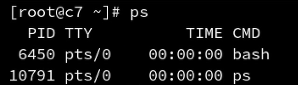

# 一、进程管理

## 进程的概念与进程查看

进程————运行中的程序，从程序开始运行到终止的整个生命周期是可管理的。

终止的方式并不唯一，分为正常终止和异常终止

* 正常终止也分为从main返回、调用exit等方式
* 异常终止分为调用abort、接收信号等
### 进程查看命令

#### ps

```plain
ps
```



PID //进程在当前系统中的唯一标识

TTY //当前执行程序的终端

TIME //进程运行的时间

```plain
ps -ef | more
```
UID //有效用户ID，进程是由哪个用户进行的（进程启动后，执行身份可以改变）
PPID //父进程，继承自什么进程

```plain
ps -eLf |more
```
LWP //线程
更多的ps指令用法请查看

```plain
man ps
```

#### pstree

```plain
pstree | more
```

#### top

```plain
top
```
直接显示进程信息和系统信息


up 35 min // 启动时间35min

load average (1min) (5min) (15min)

逐渐增加意味着系统在变得更加繁忙

Tasks: 215 total, 2 running 213 sleeping

总任务量，2个在执行，213个在睡眠

%Cpu(s) 

// CPU的使用比例，**按下数字1，可列出每个逻辑CPU的情况，**

//**再次按数字1可返回**

us // 用户计算比例

sy // 进程之间状态交互比例

id // 空闲状态

wa // IO wait 等待磁盘操作完成

KiB Mem // 内存使用比例

total //内存总计

free // 未使用内存

used // 已使用内存

buff/cache // 在进行读写缓存的内存

KiB Swap // 交换分区（win为虚拟内存）

*按“s”然后输入秒数，可更改刷新频率*

### 结论

* 进程也是树形结构
* 进程和权限有着密不可分的关系
## 进程的控制命令

### 调整优先级

nice //范围从-20到19，值越小优先级越高，抢占资源就越多

renice // 重新设置优先级

### 进程的作业控制

jobs        // 显示后台进程

& 符号       // 希望在后台启动程序时，添加到指令最后

fg + 数字    //  将后台进程【1】切换到前台进行

bg + 数字    //  将【1】进程在后台启动 

### 演示

#### 更改进程优先级

vim a.sh

```plain
#!/bin/bash    ## 声明使用bash进行的脚本

echo $$   ## 用于显示进程PID

while :
do
  :
done
```

chmod u+x a.sh

ls -l a.sh

./a.sh

19231 //屏幕返回的进程ID

新建终端1

top -p 19231

可以观察到当前NI进程优先级的值

Crtl+c退出

返回原终端

Crtl+c退出a.sh

nice -n 10 ./a.sh  // 将进程优先级设置为10并启动

23231 //屏幕返回的进程ID

新建终端2

top -p 23231

可以观察到当前NI进程优先级的值，变更为 10

新建终端3

renice -n 15 23231     // 将进程23231优先级变更为15

终端2上可以观察到当前NI进程优先级的值，变更为 15

#### 后台进行程序

./a.sh &     // 在后台启动

#### 显示后台进程

jobs     // 显示后台进程

fg 1     //  将后台进程【1】切换到前台进行

./a.sh

20414

将前台程序停止并将其切换到后台

Ctrl+z

新建终端2

top -p 20414

可以观察到 S = T 表示停止，stopped = 1

程序保存在内存当中，处于暂停的状态

jobs     // 显示后台进程

bg 1     // 将【1】进程在后台启动 

## 进程的通信方式——信号

信号是进程间通信方式之一，典型用法是：终端用户输入中断命令，通过信号机制停止一个程序的运行。

使用信号的常用快捷键和命令

kill -l      // 显示当前支持的所有信号

SIGINT 通知前台进程组终止进程ctrl+c

SIGKILL 立即结束程序，不能被阻塞和处理kill -9 pid

## 守护进程和系统日志

使用 nohup 与 & 符号配合运行一个命令

nohup命令使进程忽略hangup（挂起）信号

守护进程（daemon）和一般进程有什么差别呢？

使用screen命令   （避免网络中断导致的异常）

screen      // 进入 screen环境

ctrl+a （然后按） d    // 退出（detached）screen环境

screen -ls  // 查看screen的会话

screen -r   // sessionid恢复会话

### nohup 演示

tail -f /var/log/messages

新建终端2

ps -ef

ps -ef | grep tail

关闭终端1时，tail进程结束

#### 使终端关闭不影响进程

nohup tail -f /var/log/messages

nohup：忽略输入并把输出追加到"nohup.out"

关闭终端1

终端2

ps -ef | grep tail

显示tail父进程为1，因为孤儿进程默认父进程为1

#### 扩展

cd /proc/27451       //27451为进程号PID

该目录默认不存在，将操作系统读取的内存信息以文件的形式进行展示

ls

ls -l cwd         // 显示正在运行该进程的目录

ls -l fd          // 显示输入输出（文件描述服务）

0 -> /dev/null              // 表示输入，输入为空

1，2 -> /root/nohup.out     // 表示输出，输出到该文件

### screen 演示

yum install screen

screen      // 进入 screen环境

ctrl+a （然后按） d    // 分开（detached）screen环境

screen -ls  // 查看screen的会话

screen -r 21412  // sessionid恢复会话

exit       //退出screen环境

#### 系统日志

cd /var/log

tail -f messages  //系统日志，查看可显示需要调整的错误

tail -f dmesg     //内核启动状态日志

tail -f secure    //系统安全日志

tail -f cron      //周期性计划任务的日志

## 服务管理工具systemctl 

服务（提供常见功能的守护进程）集中管理工具

* service
* systemctl
cd /etc/init.d/

vim network       //service启动脚本

cd /usr/lib/systemd/system

vim sshd.service   //systemctl综合控制脚本

级别

0 关机

3 字符终端的多用户模式

5 图形化界面模式

6 重启

### systemctl常见操作

systemctl status|start|stop|restart|reload|enable|disable 服务名称

status 查看状态

start 开启服务

stop 停止服务

restart 重启服务

reload 重新加载配置

enable 开机启动

disable 关闭开机启动

软件包安装的服务单元

cd /usr/lib/systemd/system/

查看服务级别

cd /lib/systemd/system

ls *.target

ls -l runlevel*.target


查看当前系统运行级别

systemctl get-default

设置默认启动级别为字符终端多用户

systemctl set-default multi-user.target

cd /usr/lib/systemd/system

vim sshd.service   //systemctl综合控制脚本

启动的顺序按[Unit]进行

## SELinux简介

MAC（强制访问控制）与DAC（自主访问控制）

查看SELinux的命令

getenforce

/usr/sbin/sestatus

ps -Z and ls -Z and id -Z

关闭SELinux 

setenforce 0       //临时更改，重启后还原

/etc/selinux/sysconfig       //永久更改


# 二、内存和磁盘管理

## 内存和磁盘使用率查看

### 内存使用率查看

free -m  //按MB查看内存

free -g  //按GB查看内存

top

### 磁盘使用率查看

fdisk -l //查看磁盘

parted -l//查看磁盘

df -h 

du


du与ls的区别

du 实际占用空间

ls 加空洞占用的空间

#### 使用dd创建空洞文件

dd if=/dev/zero bs=4M count=10 of=afile

// zero文件为全0文件

// bs 单块大小

// count 总写入块数

ls -lh afile

>-rw-r--r--1 root root 40M 6月 24 15:46 afile
du -h afile

>40M afile

dd if=/dev/zero bs=4M count=10 seek=10 of=bfile

// seek 跳过块数

ls -lh bfile

>-rw-r--r--1 root root 120M 6月 24 15:47 bfile
du -h bfile

>40M bfile

## ext4文件系统

Linux支持多种文件系统，常见的有

* ext4
* xfs
* NTFS（需安装额外软件） 
    * //有版权，如果想直接插入外接使用，需要安装 ntfs-3g
    * yum install ntfs-3g
    ext4文件系统基本结构比较复杂

1. 超级块
2. 超级块副本
3. i节点（inode）
    * ls -i //查看文件的i节点
    * 记录了权限信息
4. 数据块（datablock）
### 基本的文件操作命令

touch afile

ls -li afile

du -h

echo 123 > afile

ls -li afile

du -h    // 4.0K 默认数据块大小

cp afile afile2

ls -li aflie2      //i节点发生变化

mv afile2 afile3

ls -li afile3     // i节点和afile保持一致

通过vim编辑一个文件之后，i节点发生改变

echo写入文件时，i节点不发生改变，数据块（datablock）改变

rm // 让文件名和对应的i节点的链接断开

#### 文件恢复

误删之后迅速断电，将硬盘使用恢复工具扫描，找到i节点

ls -li afile


ln afile bfile   //链接bfile到afile，ln直接操作不能跨分区

ls -li afile bfile


可以观察到连接的数量是从1变成2个，同时文件的i节点相同，因此删除（rm）任意的一个，都不会使现有的文件丢失


ln -s afile aafile    

//创建软链接，也称符号链接，会创建新文件，可以跨分区

ls -li afile aafile


类型为l，链接类型，chmod对此类型无效

#### 文件访问控制列表 facl

getfacl afile


setfacl -m u:user1:r afile    //-x可以删除权限

ls -l afile


权限出现+，代表可以使用文件访问控制查看更多用户权限

getfacl afile


## 磁盘的分区与挂载

### 常用命令

#### fdisk 分区

fdisk -l    //查看磁盘

fdisk /dev/sdc    //分区和格式化新分区

//输入m，获取帮助

n //add a new partition新建分区

p //创建为磁盘主分区

1 //分区号

2048 //起始扇区

+50G  //只创建50G，多余的空间可留在下次继续创建

p //显示已创建分区

可以使用 q //不保存退出

d //删除分区

重新创建需要的分区

w //写入到分区表

fdisk -l

//新分区已成功显示

#### mkfs 分区格式化

mkfs.ext4 或者 mkfs.xfs 都是稳定的Linux挂载形式

mkfs.ext4 /dev/sdc1

mkdir /mnt/sdc1      //新建磁盘挂载目录

#### mount 挂载到目录

mount -t ext4 或者 mount -t auto 或者 mount

// 可选的挂载方式

mount /dev/sdc1 /mnt/sdc1       //挂载磁盘

mount      //最后一行可查看到挂载情况

整体流程：

磁盘sdc -> 

fdisk分区sdc1 -> 

mkfs格式化ext4 -> 

mount挂载到目录/mnt/sdc1


#### parted 当硬盘大于2T时使用的分区方式

用于替代fdisk

parted /dev/sdd

help //获取帮助


### 开机配置文件

#### /etc/fstab

在开机时就将设备自动挂载到目录上

vim /etc/fstab

新增一行:

/dev/sdc1 /mnt/sdc1 ext4 defaults 0 0

:wq

## 用户磁盘配额

xfs文件系统的用户磁盘配额quota

mkfs.xfs /dev/sdb1

mkdir /mnt/disk1

mount -o uquota,gquota /dev/sdb1 /mnt/disk1

chmod 1777 /mnt/disk1

xfs_quota -x -c 'report -ugibh' /mnt/disk1

xfs_quota -x -c 'limit-u isoft=5 ihard=10 user1' /mnt/disk1

## 交换分区（虚拟内存）的查看与创建

增加交换分区的大小

mkswap

swapon

使用文件制作交换分区

dd if=/dev/zero bs=4M count=1024 of=/swapfile

### 使用硬盘分区扩充swap

ls -l /dev/sdd

fdisk /dev/sdd     // n w

mkswap /dev/sdd1   // 创建swap

swapon /dev/sdd1   // 打开swap

free -m

swapoff /dev/sdd1  // 关闭swap

### 使用文件方式扩充swap

dd if=/dev/zero bs=4M count=1024 of=/swapfile // 4 GB

mkswap /swapfile

chmod 600 /swapfile

swapon /swapfile

保存swap在开机时配置

vim /etc/fstab

新增一行:

/swapfile swap swap defaults 0 0

:wq

## 软件RAID的使用（演示使用，工作环境不建议）

yum install mdadm

mdadm -C /dev/md0 -a yes -l1 -n2 /dev/sd[b,c]1

-C         // 创建阵列

/dev/md0   // 约定的软件RAID的硬盘名

-a yes     // all yes

-l1        // RAID 1

-n2        // 2个活动硬盘

/dev/sd[b,c]1       // 使用通配符导入两块硬盘的位置


mdadm -D /dev/md0   //查看RAID详情

写入开机自动配置

echo DEVICE /dev/sd[b,c]1 >> /etc/mdadm.conf

mdadm -Evs >> /etc/mdadm.conf

格式化并挂载到目录上

mkfs.xfs /dev/md0

...

停止软件RAID

mdadm --stop /dev/md0

破坏超级块

dd if=/dev/zero of=/dev/sdb1 bs=1M count=1

dd if=/dev/zero of=/dev/sdc1 bs=1M count=1

## 逻辑卷LVM(Linux逻辑卷管理器)管理

已经分区/dev/sd[b,c,d]1

pvcreate /dev/sd[b,c,d]1    

//用于将物理硬盘分区初始化为物理卷，以便LVM使用。

pvs

//输出物理卷信息报表


vgcreate vg1 /dev/sdc1 /dev/sdb1    // 创建卷组

//vg1 卷组名称

vgs   //报告关于卷组的信息


lvcreate -L 100M -n lv1 vg1      //创建逻辑卷

lvs    //报告有关逻辑卷的信息


mkdir /mnt/test

mkfs.xfs /dev/vg1/lv1

mount ... 

硬盘文件系统的划分实际上是一个分层的结构

fdisk /dev/sd??  ->

/dev/md0  ->

pv  ->

vg  ->

lv1  ->

xfs  ->

mount /mnt/dir

#### 扩充磁盘

vgextend centos /dev/sdd1

lvcreat -L 100M -n lv1 vg1

lvextend -L +50G /dev/centos/root

df -h //检查发现实际未被扩展

xfs_growfs /dev/centos/root

## 系统综合状态查看命令sar

### sar命令查看系统综合状态

yum install sysstat

sar -u 1 10   //-u CPU 查看，间隔1s，显示10次

sar -r 1 10   //-r RAM 查看，间隔1s，显示10次

sar -b 1 10   //-b 读写IO 查看，间隔1s，显示10次

sar -d 1 10   //-d Disk 查看，间隔1s，显示10次

sar -q 1 10   //-q 进程 查看，间隔1s，显示10次

### 使用iftop查看网络流量（整合展示界面）

yum install epel-release 

yum install iftop

iftop -P


