# 一、shell简介

## 什么是shell 

Shell是命令解释器，用于解释用户对操作系统的操作

Shell有很多

cat /etc/shells 

CentOS7默认使用的Shell是bash

基于bshell，重写的bash，a代表again

## Linux的启动过程

6个过程

BIOS（主板-硬盘）-

MBR（主引导）-

BootLoader（grub）（启动和引导内核的工具）-

kernel（内核启动）-

systemd（1号进程centos7，centos6的是init）-

系统初始化-

shell

dd if=/dev/sda of=mbr.bin bs=446 count=1

//dd 拷贝文件并转换，详见[https://www.linuxcool.com/dd](https://www.linuxcool.com/dd)

//bs 代表block size

//count=1 一块

// 硬盘的主引导记录mbr.bin没有文件系统，可用16进制查询

hexdump -C mbr.bin     //-C 显示字符

硬盘的主引导记录

// 包含分区表的硬盘的主引导记录

dd if=/dev/sda of=mbr2.bin bs=512 count=1

hexdump -C mbr.bin | more

//最后的4行（64字节），代表分区表

cd /boot/grub2

ls

grub2-editenv list     //显示默认引导内核版本

uname -r      // 查看当前内核版本

【centos6】

which init

top -p 1

## 怎样编写一个shell脚本

UNIX的哲学：一条命令只做一件事

为了组合命令和多次执行，使用脚本文件来保存需要执行的命令

赋予该文件执行权限（chmod u+rx filename）

vim 1.sh

```plain
#!/bin/bash

# demo
cd /var/
ls
pwd
du -sh
du -sh *
```

chmod u+x 1.sh

ls -l 1.sh

// 试用bash执行脚本可以不增加可执行权限

bash 1.sh

vim 2.sh

```plain
#!/bin/bash

#demo 2
cd /tmp
pwd
```
// 会提示权限不够
./2.sh

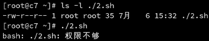


## 内建命令和外部命令的区别

```plain
bash ./2.sh

./2.sh
```
上面这两种方式执行，都会产生新的子进程，cd 为内部命令，不会对当前的执行环境产生影响
内建命令：使用下面两种方式执行脚本，不会产生新的子进程，因此会对当前工作环境产生影响

```plain
source ./2.sh

. ./2.sh
```

## 管道与重定向

**管道**是进程通信的通信工具，吧第一个程序的输出作为第二个程序的输入

**重定向**可以把标准输出，重定向输出到文件中，也可以重定向到执行命令中

管道和信号一样，也是进程通信的方式之一

匿名管道（管道符）是Shell编程经常用到的通信工具

管道符是“|”，将前一个命令执行的结果传递给后面的命令

ps | cat

echo 123 | ps


一个进程默认会打开标准输入、标准输出、错误输出三个文件描述符

输入重定向符号“<”

* read var < /path/to/a/file
输出重定向符号 

1. “>” 会清空原来的文件，然后进行输入
2. “>>” 在末尾追加输入内容
3. “2>” 如果执行产生错误，会将错误信息输入到文件中
4. “&>” 无论输出的正确与否，都将信息传入到文件中
* echo 123 > /path/to/a/file
输入和输出重定向组合使用

* cat > /path/to/a/file << EOF
* I am $USER
* EOF
### 示例

wc -l

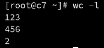


会统计输入信息的行数

wc -l < /ect/passwd

// 使用read 读入信息，并存入var变量当中

read var

echo $var

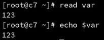


vim a.txt

```plain
123
```

read var2 < a.txt

echo $var2

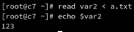


echo $var2 > b.txt

cat b.txt

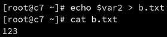


echo $var2 >> b.txt

cat b.txt

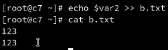


vim 3.sh

```plain
#!/bin/bash

cat > /root/a.sh <<EOF
echo "hello bash"
EOF
```
bash 3.sh
cat /root/a.sh

# 二、变量赋值

## 变量的定义

变量名的命名规则

* 字母、数字、下划线
* 不以数字开头
## 赋值

为变量赋值的过程，称为变量替换

变量名=变量值

等号的左侧和右侧不允许出现空格

* a=123
使用let为变量赋值

尽量不要涉及到计算，因为bash是解释型语言，性能非常低

* let a=10+20
将命令赋值给变量

* l=ls
将命令结果赋值给变量，使用$（）或者``

* letc=$(ls -l /etc)
变量值有空格等特殊字符可以包含在""或''中

变量的引用

* ${变量名}称作对变量的引用
* echo${变量名}查看变量的值
* ${变量名}在部分情况下可以省略为$变量名
变量的默认作用范围

子进程无法继承父进程的变量

变量的导出

* export
变量的删除

* unset
# 三、系统环境变量

环境变量：每个Shell打开都可以获得到的变量

## env 命令

* $PATH   
//默认可执行命令的搜索路径，仅仅对当前的Shell生效，同时对子Shell也生效

//新增PATH

PATH=$PATH:/root

* $PS1
// 终端前配符号的更改

## set 命令

* $？  
//上一条命令是否正确执行， 正确等于0，错误不等于0

* $$  
//显示当前进程PID

* $0
//当前运行方式

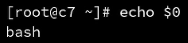

## 位置变量

定义“-a -b -c...的执行传入参数”

* $1 $2... ${10}...
```plain
echo $1
#为了规避2号参数没有值传入而产生不必要的问题，可以在2后面加"-_"
#这时如果传入空值的时候则实际读取为"_"，如果有内容则赋值
echo ${2-_}
```

## 配置文件

* /etc/profile
* 目录/etc/profile.d/
* ~/.bash_profile
* ~/.bashrc
* /etc/bashrc
凡是保存在/etc/下的，是所有用户的通用配置

~代表用户家目录，保存用户的配置文件

### login shell

su - user1

使用前三个profile配置文件（此时为login shell）

先加载/etc/profile

后加载~/.bash_profile

然后再加载~/.bashrc

最后加载/etc/bashrc


### nologin shell

su user1

使用后两个bashrc配置文件（此时为nologin shell）

先加载~/.bashrc

后加载/etc/bashrc

### 使新修改的配置文件生效

source /etc/bashrc


# 四、数组

定义数组（里面用空格分开）

* IPTS=( 10.0.0.1 10.0.0.2 10.0.0.3 )
显示数组的**所有**元素（花括号和数组名称之间，不能有空格）

* echo ${IPTS[@]}
显示数组**元素个数**（花括号和数组名称之间，不能有空格）

* echo ${#IPTS[@]}
显示数组的**第一个**元素（花括号和数组名称之间，不能有空格）

* echo ${IPTS[0]}
# 五、特殊字符# " ' `\ ;

特殊字符：一个字符不仅有字面意义，还有元意（meta-meaning）

* #注释
* ;分号————分隔两行的命令
* \转义符号
  单个字符前的转义符号

    * \n \r \t 单个字母的转义
    * \$ \" \\ 单个非字母的转义

#### "双引号（不完全引用）

会进行解释

#### '单引号（完全引用）

里面是什么就显示什么


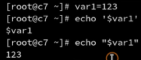


* `反引号
# 六、运算符

## 赋值运算符

* =赋值运算符，用于算数赋值和字符串赋值
* 使用unset取消为变量的赋值
* =除了作为赋值运算符还可以作为测试操作符
## 算数运算符

### 基本运算符

``` 
+ - * / ** %
```

使用 expr 进行运算（仅支持整数）(符号和数字之间需要空格）

a=expr 4 + 5

### 数字常量

数字常量的使用方法

* let "变量名=变量值"
* 变量值使用0开头为八进制
* 变量值使用0x开头为十六进制
### 双圆括号

双圆括号是let命令的简化

* ((a=10))
* ((a++))
* echo $((10+20))
## 示例

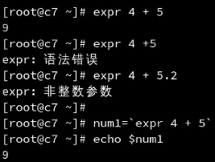


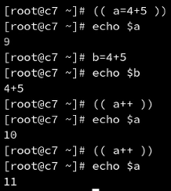


## 特殊符号大全

### 引号

单引号'完全引用

双引号"不完全引用

反引号`执行命令

### 括号

#### () (()) $() 圆括号

()单独使用圆括号会产生一个子shell( xyz=123 )

()数组初始化数组IPS=(ip1 ip2 ip3)

(())算术运算

$()里面加命令可以将命令结果赋值给变量

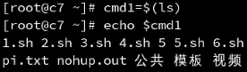


#### [][[]]方括号

[]单独使用方括号是测试(test)或数组元素功能

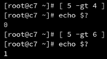


测试5>4 ?

测试5>6 ?

[[]]两个方括号表示测试表达式

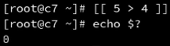


#### < > 尖括号 重定向符号

#### {} 花括号

输出范围echo {0..9}

文件复制（剪贴mv）cp -v /etc/passwd{,.bak}

### 运算和逻辑符号

+-*/% 算数运算符

><= 比较运算符

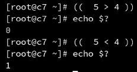


&&‖! 逻辑运算符

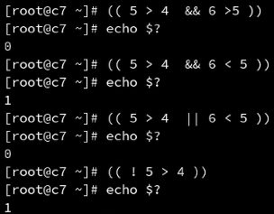


### \转义符号

\n普通字符转义之后有不同的功能

\`特殊字符转义之后，当做普通字符来使用


### 其他符号


; 命令分隔符

    case语句的分隔符要转义 ;;

// 一行命令分步执行，如果变成两行，则网卡在断开后无法连接

ifdown eth0 ; ifup eth0

​    

//增加脚本可读性

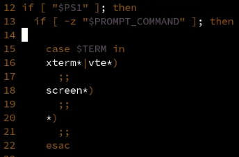


: 空指令

. 和 source 命令相同

~ 家目录

, 分隔目录

* 通配符

? 条件测试 或 通配符

$ 取值符号

| 管道符

& 后台运行

_ 空格

# 七、脚本test测试

```bash
cd ~/
vim test.sh
chomd a+x test.sh
ls -l test.sh
```

## 退出与退出状态

```shell
#!/bin/bash

pwd

# 如果exit上面的命令出错，则返回值不为0
exit

# 也可使用自定义返回值
exit 127
```

$?判断当前 Shell 前一个进程是否正常退出

## 测试命令 test

test 命令用于检查文件或者比较值

test 可以做以下测试:

- 文件测试
- 整数比较测试
- 字符串测试

test 测试语句可以简化为[]符号
[]符号还有扩展写法[]支持&&、‖、<、>

## 使用 if-then 语句

if-then 语句的基本用法

- if[测试条件成立] 或 命令返回值是否为 0
- then 执行相应命令
- fi 结束

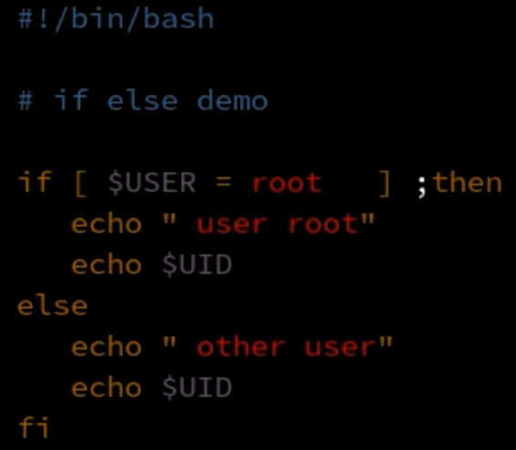

if-then-else语句可以在条件不成立时也运行相应的命令

- if[测试条件成立]
- then执行相应命令
- elif[测试条件成立]
- then执行相应命令
- else测试条件不成立,执行相应命令
- fi结束

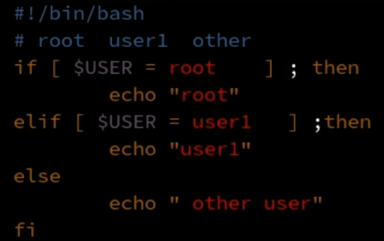

## 使用分支

case语句和select语句可以构成分支

- case "$变量" in
    - "情况1")
        - 命令…;;
    - "情况2")
        - 命令…;;
    - *)
        - 命令…;;
- esac

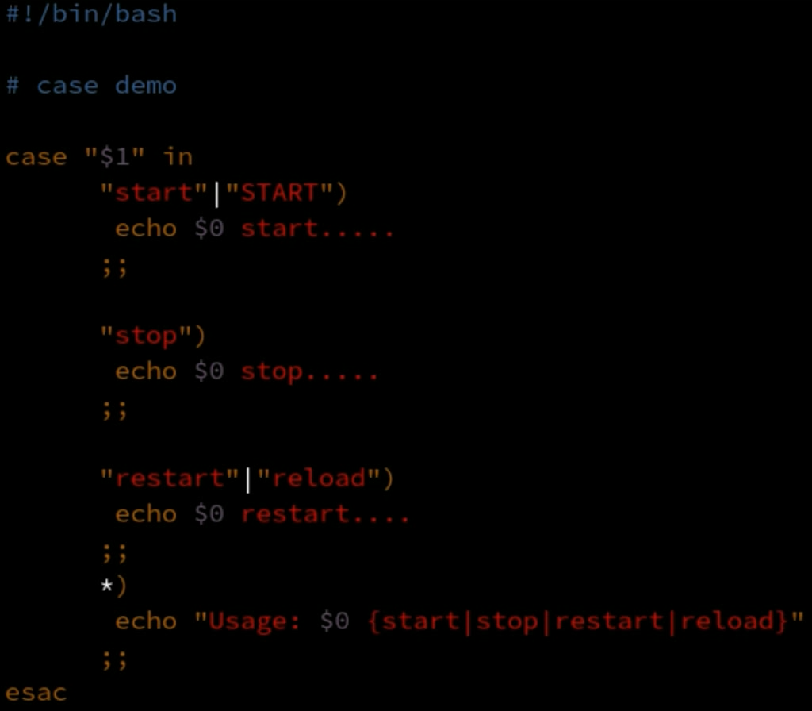

## 循环

### 使用for循环遍历命令的执行结果

for循环的语法

- for 参数 in 列表
- do 执行的命令
- done 封闭一个循环

使用反引号或 $() 方式执行命令,命令的结果当作列表进行处理

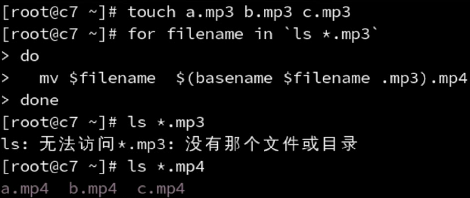

### 使用for循环遍历变量和文件的内容

列表中包含多个变量,变量用空格分隔

对文本处理,要使用文本查看命令取出文本内容

- 默认逐行处理,如果文本出现空格会当做多行处理

### C语言风格的for命令

for((变量初始化;循环判断条件;变量变化))
do
	循环执行的命令
done

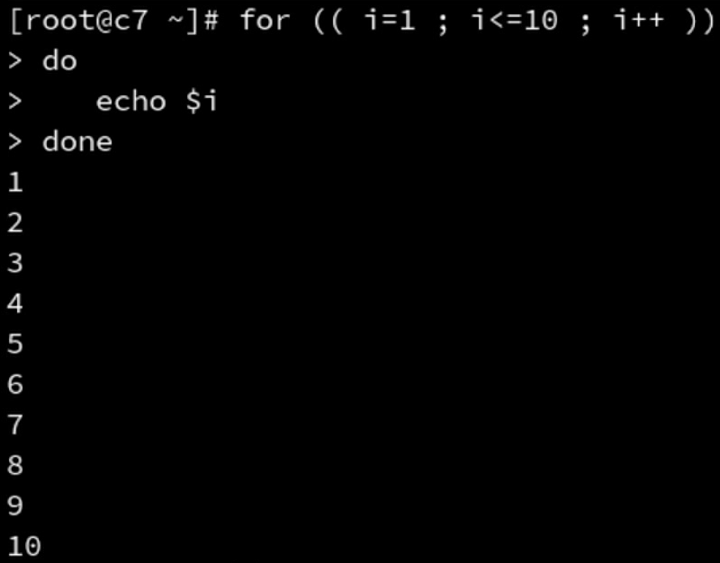

### while循环

while test 测试***是否***成立
do
	命令
done

### 死循环

while test 测试***一直***成立
do
	命令
done

```shell
while :
do
	echo "always"
done
```

### until循环

```shell
until [ 5 -lt 4 ] 
do 
	echo always
done
```

### 循环的使用
- 循环和循环可以嵌套
- 循环中可以嵌套判断，反过来也可以嵌套
- 循环可以使用 break 和 continue 语句在循环中退出

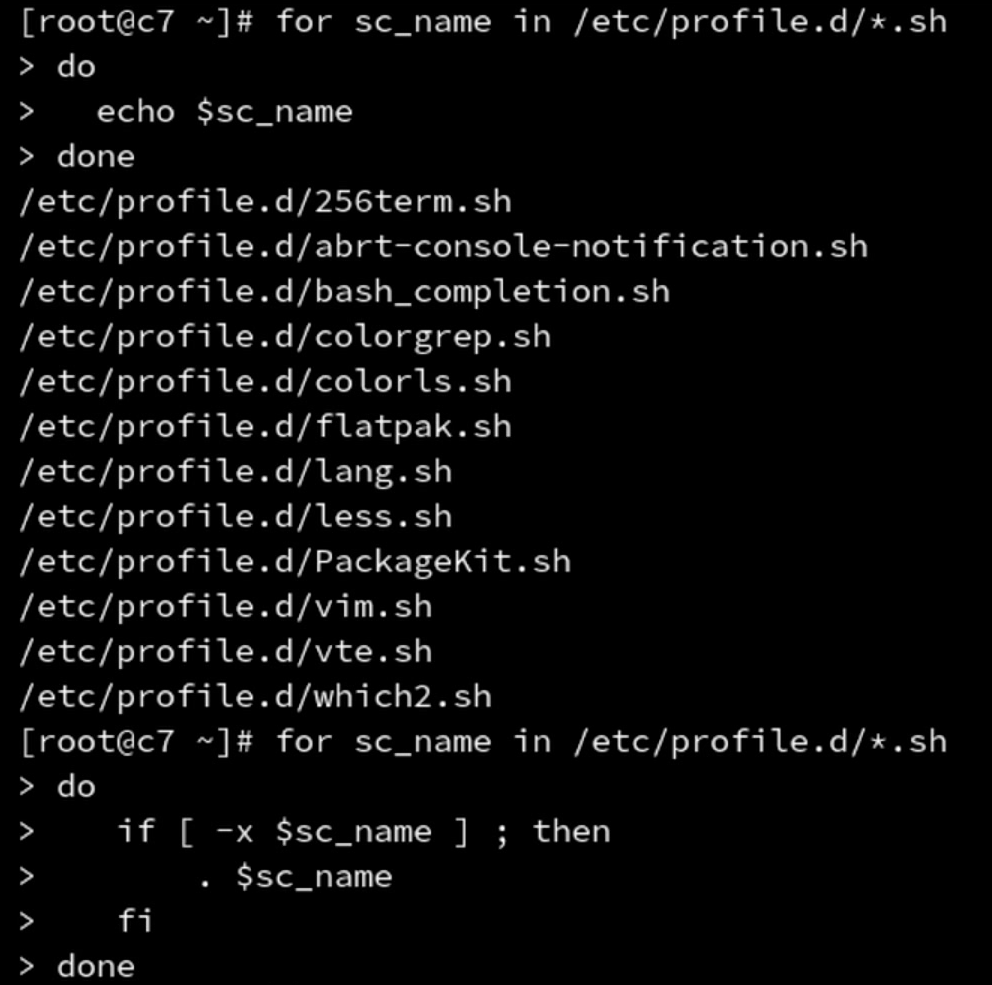

#### break和continue语句

- break 结束循环
- continue 结束本次循环

### 使用循环对命令行参数的处理

- 命令行参数可以使用 $1 $2..${10}... $n 进行读取
- $0 代表脚本名称
- $* 和 $@ 代表所有位置参数
- $# 代表位置参数的数量

使用for循环

```shell
#!/bin/bash
# help display help help
for pos in $*
do
	if [ "$pos" = "help" ] ; then
		echo $pos $pos
	fi
done
```

使用while循环

```shell
#!/bin/bash
# help display help help
while [ $# -ge 1 ]
do
	if [ "$1" = "help" ] ; then
		echo $1 $1
	fi
	# 使用shift读取下一个参数
	shift
done
```

# 八、函数

## 自定义函数

- 函数用于"包含"重复使用的命令集合

- 自定义函数
    	function fname(){
    		命令
    	}

- 函数的执行
    	fname

- 函数作用范围的变量
    	local变量名
    
- 函数的参数
    $1 $2 $3 .. $n

```shell
cdls() {
	cd $1
	ls
}
```

```shell
#!/bin/bash

# functions

checkpid() {

	# 声明一个本地变量i，仅在该函数内生效
	local i
	
	for i in $* ; do
	[
		-d "/proc/$i"
	] && return 0
	done
	
	return 1
}
```

## 系统脚本

系统自建了函数库,可以在脚本中引用
	/etc/init.d/functions
	
自建函数库
	使用 source 函数脚本文件"导入"函数

```
#导入到当前的运行环境
source /etc/init.d/functions

echo_success

```

系统环境变量
	/ect/profile

