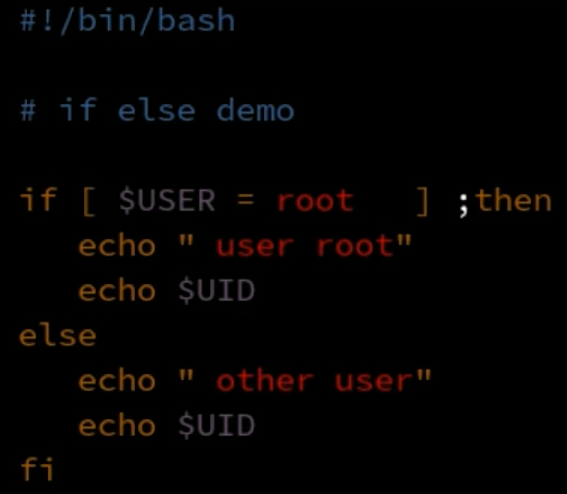
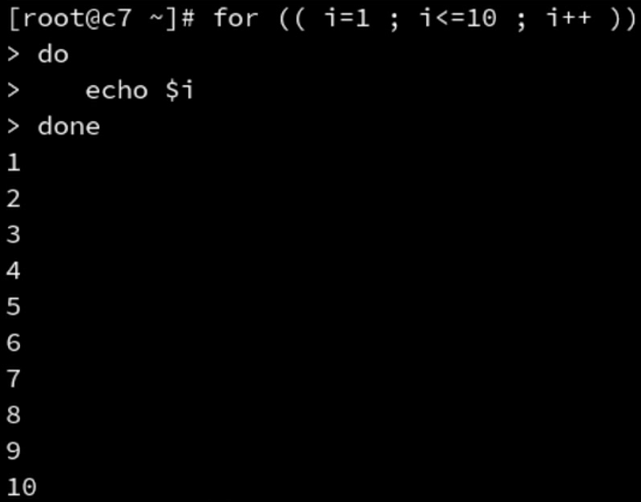

# Shell Test

```bash
cd ~/
vim test.sh
chomd a+x test.sh
ls -l test.sh
```

## 退出与退出状态

```shell
#!/bin/bash

pwd

# 如果exit上面的命令出错，则返回值不为0
exit

# 也可使用自定义返回值
exit 127
```

$?判断当前 Shell 前一个进程是否正常退出

## 测试命令 test

test 命令用于检查文件或者比较值

test 可以做以下测试:

- 文件测试
- 整数比较测试
- 字符串测试

test 测试语句可以简化为[]符号
[]符号还有扩展写法[]支持&&、‖、<、>

## 使用 if-then 语句

if-then 语句的基本用法

- if[测试条件成立] 或 命令返回值是否为 0
- then 执行相应命令
- fi 结束



if-then-else语句可以在条件不成立时也运行相应的命令

- if[测试条件成立]
- then执行相应命令
- elif[测试条件成立]
- then执行相应命令
- else测试条件不成立,执行相应命令
- fi结束


## 使用分支

case语句和select语句可以构成分支

- case "$变量" in
    - "情况1")
        - 命令…;;
    - "情况2")
        - 命令…;;
    - *)
        - 命令…;;
- esac


## 循环

### 使用for循环遍历命令的执行结果

for循环的语法

- for 参数 in 列表
- do 执行的命令
- done 封闭一个循环

使用反引号或 $() 方式执行命令,命令的结果当作列表进行处理


### 使用for循环遍历变量和文件的内容

列表中包含多个变量,变量用空格分隔

对文本处理,要使用文本查看命令取出文本内容

- 默认逐行处理,如果文本出现空格会当做多行处理

### C语言风格的for命令

for((变量初始化;循环判断条件;变量变化))
do
	循环执行的命令
done



### while循环

while test 测试***是否***成立
do
	命令
done

### 死循环

while test 测试***一直***成立
do
	命令
done

```shell
while :
do
	echo "always"
done
```

### until循环

```shell
until [ 5 -lt 4 ] 
do 
	echo always
done
```

### 循环的使用
- 循环和循环可以嵌套
- 循环中可以嵌套判断，反过来也可以嵌套
- 循环可以使用 break 和 continue 语句在循环中退出


#### break和continue语句

- break 结束循环
- continue 结束本次循环

### 使用循环对命令行参数的处理

- 命令行参数可以使用 $1 $2..${10}... $n 进行读取
- $0 代表脚本名称
- $* 和 $@ 代表所有位置参数
- $# 代表位置参数的数量

使用for循环

```shell
#!/bin/bash
# help display help help
for pos in $*
do
	if [ "$pos" = "help" ] ; then
		echo $pos $pos
	fi
done
```

使用while循环

```shell
#!/bin/bash
# help display help help
while [ $# -ge 1 ]
do
	if [ "$1" = "help" ] ; then
		echo $1 $1
	fi
	# 使用shift读取下一个参数
	shift
done
```

