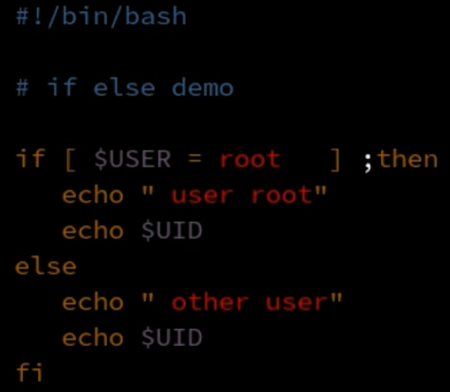
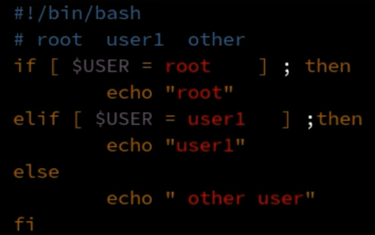
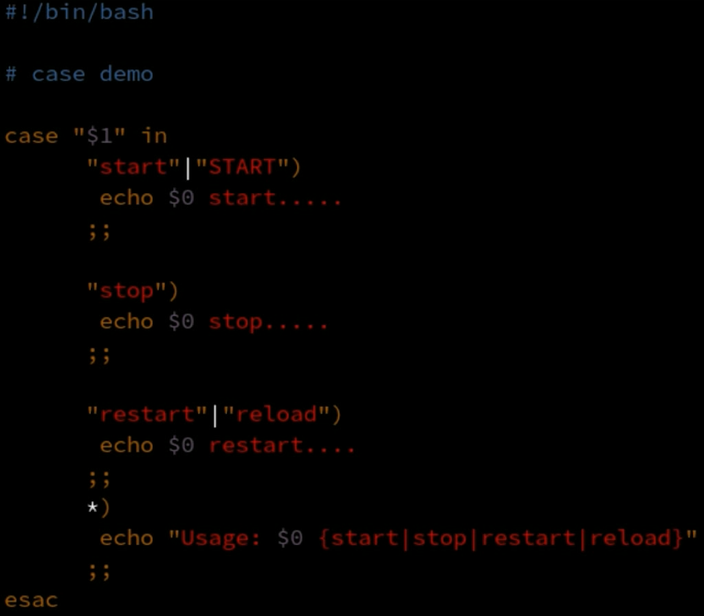
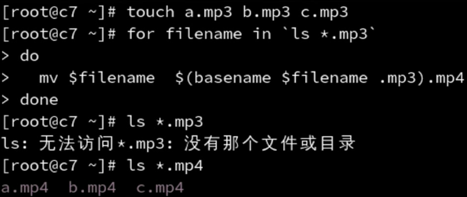
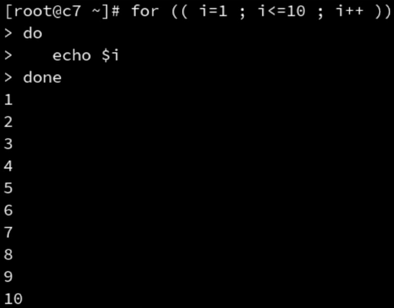
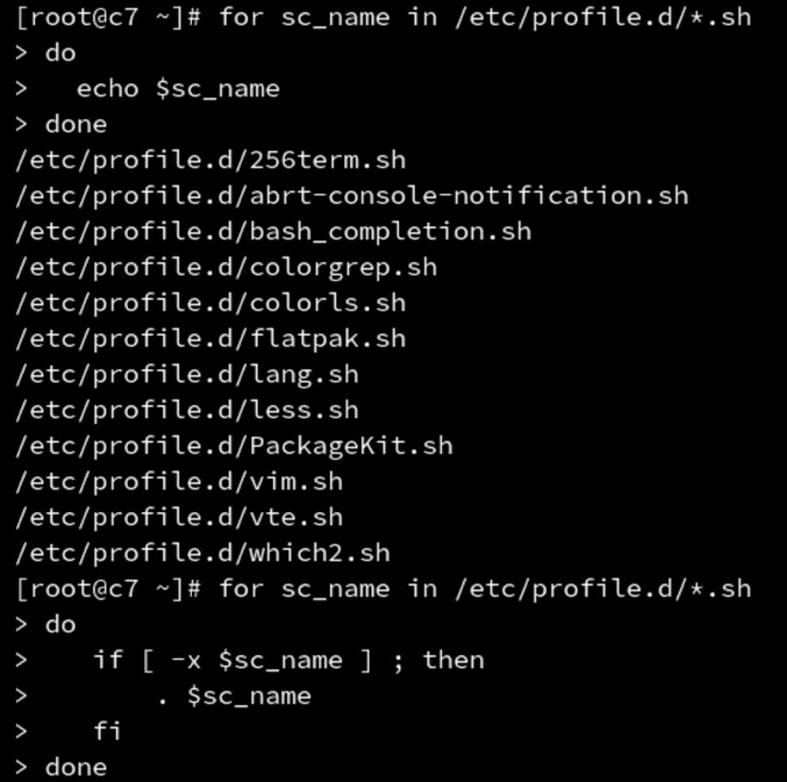

# 3.Shell-script

## 一、shell简介

### 什么是shell

Shell是命令解释器，用于解释用户对操作系统的操作

Shell有很多

cat /etc/shells

CentOS7默认使用的Shell是bash

基于bshell，重写的bash，a代表again

### Linux的启动过程

6个过程

BIOS（主板-硬盘）-

MBR（主引导）-

BootLoader（grub）（启动和引导内核的工具）-

kernel（内核启动）-

systemd（1号进程centos7，centos6的是init）-

系统初始化-

shell

dd if=/dev/sda of=mbr.bin bs=446 count=1

//dd 拷贝文件并转换，详见[https://www.linuxcool.com/dd](https://www.linuxcool.com/dd)

//bs 代表block size

//count=1 一块

// 硬盘的主引导记录mbr.bin没有文件系统，可用16进制查询

hexdump -C mbr.bin //-C 显示字符

硬盘的主引导记录

// 包含分区表的硬盘的主引导记录

dd if=/dev/sda of=mbr2.bin bs=512 count=1

hexdump -C mbr.bin | more

//最后的4行（64字节），代表分区表

cd /boot/grub2

ls

grub2-editenv list //显示默认引导内核版本

uname -r // 查看当前内核版本

【centos6】

which init

top -p 1

### 怎样编写一个shell脚本

UNIX的哲学：一条命令只做一件事

为了组合命令和多次执行，使用脚本文件来保存需要执行的命令

赋予该文件执行权限（chmod u+rx filename）

vim 1.sh

```
#!/bin/bash

# demo
cd /var/
ls
pwd
du -sh
du -sh *
```

chmod u+x 1.sh

ls -l 1.sh

// 试用bash执行脚本可以不增加可执行权限

bash 1.sh

vim 2.sh

```
#!/bin/bash

#demo 2
cd /tmp
pwd
```

// 会提示权限不够 ./2.sh


### 内建命令和外部命令的区别

```
bash ./2.sh

./2.sh
```

上面这两种方式执行，都会产生新的子进程，cd 为内部命令，不会对当前的执行环境产生影响 内建命令：使用下面两种方式执行脚本，不会产生新的子进程，因此会对当前工作环境产生影响

```
source ./2.sh

. ./2.sh
```

### 管道与重定向

**管道**是进程通信的通信工具，吧第一个程序的输出作为第二个程序的输入

**重定向**可以把标准输出，重定向输出到文件中，也可以重定向到执行命令中

管道和信号一样，也是进程通信的方式之一

匿名管道（管道符）是Shell编程经常用到的通信工具

管道符是“|”，将前一个命令执行的结果传递给后面的命令

ps | cat

echo 123 | ps

一个进程默认会打开标准输入、标准输出、错误输出三个文件描述符

输入重定向符号“<”

* read var < /path/to/a/file 输出重定向符号

1. “>” 会清空原来的文件，然后进行输入
2. “>>” 在末尾追加输入内容
3. “2>” 如果执行产生错误，会将错误信息输入到文件中
4. “&>” 无论输出的正确与否，都将信息传入到文件中

* echo 123 > /path/to/a/file 输入和输出重定向组合使用
* cat > /path/to/a/file << EOF
* I am $USER
* EOF

#### 示例

wc -l


会统计输入信息的行数

wc -l < /ect/passwd

// 使用read 读入信息，并存入var变量当中

read var

echo $var


vim a.txt

```
123
```

read var2 < a.txt

echo $var2


echo $var2 > b.txt

cat b.txt


echo $var2 >> b.txt

cat b.txt


vim 3.sh

```
#!/bin/bash

cat > /root/a.sh <<EOF
echo "hello bash"
EOF
```

bash 3.sh cat /root/a.sh

## 二、变量赋值

### 变量的定义

变量名的命名规则

* 字母、数字、下划线
* 不以数字开头

### 赋值

为变量赋值的过程，称为变量替换

变量名=变量值

等号的左侧和右侧不允许出现空格

* a=123 使用let为变量赋值

尽量不要涉及到计算，因为bash是解释型语言，性能非常低

* let a=10+20 将命令赋值给变量
* l=ls 将命令结果赋值给变量，使用$（）或者\`\`
* letc=$(ls -l /etc) 变量值有空格等特殊字符可以包含在""或''中

变量的引用

* ${变量名}称作对变量的引用
* echo${变量名}查看变量的值
* ${变量名}在部分情况下可以省略为$变量名 变量的默认作用范围

子进程无法继承父进程的变量

变量的导出

* export 变量的删除
* unset

## 三、系统环境变量

环境变量：每个Shell打开都可以获得到的变量

### env 命令

* $PATH\
  //默认可执行命令的搜索路径，仅仅对当前的Shell生效，同时对子Shell也生效

//新增PATH

PATH=$PATH:/root

* $PS1 // 终端前配符号的更改

### set 命令

* $？\
  //上一条命令是否正确执行， 正确等于0，错误不等于0
*

//显示当前进程PID

* $0 //当前运行方式


### 位置变量

定义“-a -b -c...的执行传入参数”

* $1 $2... ${10}...

```
echo $1
#为了规避2号参数没有值传入而产生不必要的问题，可以在2后面加"-_"
#这时如果传入空值的时候则实际读取为"_"，如果有内容则赋值
echo ${2-_}
```

### 配置文件

* /etc/profile
* 目录/etc/profile.d/
* \~/.bash\_profile
* \~/.bashrc
* /etc/bashrc 凡是保存在/etc/下的，是所有用户的通用配置

\~代表用户家目录，保存用户的配置文件

#### login shell

su - user1

使用前三个profile配置文件（此时为login shell）

先加载/etc/profile

后加载\~/.bash\_profile

然后再加载\~/.bashrc

最后加载/etc/bashrc

#### nologin shell

su user1

使用后两个bashrc配置文件（此时为nologin shell）

先加载\~/.bashrc

后加载/etc/bashrc

#### 使新修改的配置文件生效

source /etc/bashrc

## 四、数组

定义数组（里面用空格分开）

* IPTS=( 10.0.0.1 10.0.0.2 10.0.0.3 ) 显示数组的**所有**元素（花括号和数组名称之间，不能有空格）
* echo ${IPTS\[@]} 显示数组**元素个数**（花括号和数组名称之间，不能有空格）
* echo ${#IPTS\[@]} 显示数组的**第一个**元素（花括号和数组名称之间，不能有空格）
* echo ${IPTS\[0]}

## 五、特殊字符# " ' \`\ ;

特殊字符：一个字符不仅有字面意义，还有元意（meta-meaning）

* \#注释
* ;分号————分隔两行的命令
* \转义符号 单个字符前的转义符号
  * \n \r \t 单个字母的转义
  * $ " \ 单个非字母的转义

**"双引号（不完全引用）**

会进行解释

**'单引号（完全引用）**

里面是什么就显示什么


* \`反引号

## 六、运算符

### 赋值运算符

* \=赋值运算符，用于算数赋值和字符串赋值
* 使用unset取消为变量的赋值
* \=除了作为赋值运算符还可以作为测试操作符

### 算数运算符

#### 基本运算符

```
+ - * / ** %
```

使用 expr 进行运算（仅支持整数）(符号和数字之间需要空格）

a=expr 4 + 5

#### 数字常量

数字常量的使用方法

* let "变量名=变量值"
* 变量值使用0开头为八进制
* 变量值使用0x开头为十六进制

#### 双圆括号

双圆括号是let命令的简化

* ((a=10))
* ((a++))
* echo $((10+20))

### 示例


### 特殊符号大全

#### 引号

单引号'完全引用

双引号"不完全引用

反引号\`执行命令

#### 括号

**() (()) $() 圆括号**

()单独使用圆括号会产生一个子shell( xyz=123 )

()数组初始化数组IPS=(ip1 ip2 ip3)

(())算术运算

$()里面加命令可以将命令结果赋值给变量


**\[]\[\[]]方括号**

\[]单独使用方括号是测试(test)或数组元素功能


测试5>4 ?

测试5>6 ?

\[\[]]两个方括号表示测试表达式


**< > 尖括号 重定向符号**

**{} 花括号**

输出范围echo {0..9}

文件复制（剪贴mv）cp -v /etc/passwd{,.bak}

#### 运算和逻辑符号

\+-\*/% 算数运算符

> <= 比较运算符


&&‖! 逻辑运算符


#### \转义符号

\n普通字符转义之后有不同的功能

\`特殊字符转义之后，当做普通字符来使用

#### 其他符号

; 命令分隔符

```
case语句的分隔符要转义 ;;
```

// 一行命令分步执行，如果变成两行，则网卡在断开后无法连接

ifdown eth0 ; ifup eth0

​

//增加脚本可读性


: 空指令

. 和 source 命令相同

\~ 家目录

, 分隔目录

* 通配符

? 条件测试 或 通配符

$ 取值符号

\| 管道符

& 后台运行

\_ 空格

## 七、脚本test测试

```bash
cd ~/
vim test.sh
chomd a+x test.sh
ls -l test.sh
```

### 退出与退出状态

```shell
#!/bin/bash

pwd

# 如果exit上面的命令出错，则返回值不为0
exit

# 也可使用自定义返回值
exit 127
```

$?判断当前 Shell 前一个进程是否正常退出

### 测试命令 test

test 命令用于检查文件或者比较值

test 可以做以下测试:

* 文件测试
* 整数比较测试
* 字符串测试

test 测试语句可以简化为\[]符号 \[]符号还有扩展写法\[]支持&&、‖、<、>

### 使用 if-then 语句

if-then 语句的基本用法

* if\[测试条件成立] 或 命令返回值是否为 0
* then 执行相应命令
* fi 结束



if-then-else语句可以在条件不成立时也运行相应的命令

* if\[测试条件成立]
* then执行相应命令
* elif\[测试条件成立]
* then执行相应命令
* else测试条件不成立,执行相应命令
* fi结束



### 使用分支

case语句和select语句可以构成分支

* case "$变量" in
  * "情况1")
    * 命令…;;
  * "情况2")
    * 命令…;;
  * \*)
    * 命令…;;
* esac



### 循环

#### 使用for循环遍历命令的执行结果

for循环的语法

* for 参数 in 列表
* do 执行的命令
* done 封闭一个循环

使用反引号或 $() 方式执行命令,命令的结果当作列表进行处理



#### 使用for循环遍历变量和文件的内容

列表中包含多个变量,变量用空格分隔

对文本处理,要使用文本查看命令取出文本内容

* 默认逐行处理,如果文本出现空格会当做多行处理

#### C语言风格的for命令

for((变量初始化;循环判断条件;变量变化)) do 循环执行的命令 done



#### while循环

while test 测试_**是否**_成立 do 命令 done

#### 死循环

while test 测试_**一直**_成立 do 命令 done

```shell
while :
do
	echo "always"
done
```

#### until循环

```shell
until [ 5 -lt 4 ] 
do 
	echo always
done
```

#### 循环的使用

* 循环和循环可以嵌套
* 循环中可以嵌套判断，反过来也可以嵌套
* 循环可以使用 break 和 continue 语句在循环中退出



**break和continue语句**

* break 结束循环
* continue 结束本次循环

#### 使用循环对命令行参数的处理

* 命令行参数可以使用 $1 $2..${10}... $n 进行读取
* $0 代表脚本名称
* $\* 和 $@ 代表所有位置参数
* $# 代表位置参数的数量

使用for循环

```shell
#!/bin/bash
# help display help help
for pos in $*
do
	if [ "$pos" = "help" ] ; then
		echo $pos $pos
	fi
done
```

使用while循环

```shell
#!/bin/bash
# help display help help
while [ $# -ge 1 ]
do
	if [ "$1" = "help" ] ; then
		echo $1 $1
	fi
	# 使用shift读取下一个参数
	shift
done
```

## 八、函数

### 自定义函数

* 函数用于"包含"重复使用的命令集合
* 自定义函数 function fname(){ 命令 }
* 函数的执行 fname
* 函数作用范围的变量 local变量名
* 函数的参数 $1 $2 $3 .. $n

```shell
cdls() {
	cd $1
	ls
}
```

```shell
#!/bin/bash

# functions

checkpid() {

	# 声明一个本地变量i，仅在该函数内生效
	local i
	
	for i in $* ; do
	[
		-d "/proc/$i"
	] && return 0
	done
	
	return 1
}
```

### 系统脚本

系统自建了函数库,可以在脚本中引用 /etc/init.d/functions

自建函数库 使用 source 函数脚本文件"导入"函数

```
#导入到当前的运行环境
source /etc/init.d/functions

echo_success
```

系统环境变量 /ect/profile
