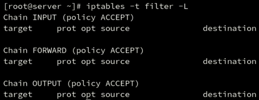
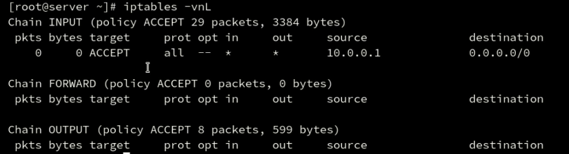
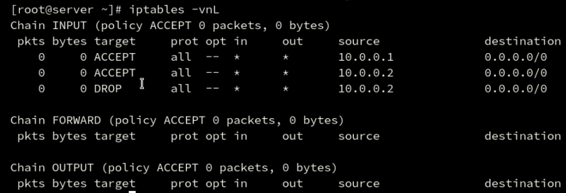
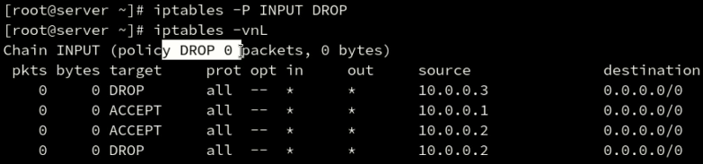
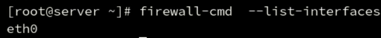
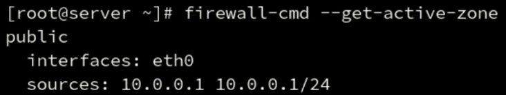

# 一、防火墙

## 防火墙分类

软件防火墙和硬件防火墙

包过滤防火墙和应用层防火墙

* CentOS6默认的防火墙是iptables
* CentOS7默认的防火墙是firewallD（底层使用netfilter）

```
LANG=c man iptables        // LANG=c 查看英文iptables帮助
```


## iptables的表和链

规则表

* filter nat mangle raw
规则链

* INPUT(外部请求进入的) OUTPUT(当前主机发出去的数据包) FORWARD(数据包经过当前主机转发的)
* PREROUTING路由前转换（改变目标地址） POSTROUTING路由后转换（控制源地址）

## iptables的filter表

iptables -t filter 命令 规则链 规则 动作（允许或阻止）

// filter 代表做过滤，可更改为 nat 代表做地址转换

命令

* -L //显示已经过滤的规则
// -nL 可以不显示反向解析的域名直接输出结果IP

// -vnL 显示更详细的信息

// -t filter 为默认，可以省略






* -A //新增规则（在已有规则的后面）

  ```
  iptables -t filter -A INPUT -s 10.0.0.1 -j ACCEPT
  ```

  

// INPUT 规则方向 

// -s 源IP

// -j 是允许还是阻止

// -t filter 为默认，可以省略

```
iptables -A INPUT -s 10.0.0.0/24 -j ACCEPT
```

// -s 10.0.0.0/24 添加0/24网段 

```
iptables -t filter -A INPUT -i eth0 -s 10.0.0.2 -p tcp --dport 80 -j ACCEPT
```


// -i 进入网卡

// -o 输出网卡

// -d 目的地址

// -p 协议（tcp等）

// --dport  端口

```
iptables -t filter -A INPUT -j DROP
```

// 全部阻止

```
iptables -A INPUT -s 10.0.0.2 -j DROP
```

// DROP 阻止

// 如果在这之前已经允许进入时，DROP 无效，数据包依旧可以进入，因此需要-I




* -I //新增规则（在已有规则的开头）

  ```
  iptables -I INPUT -s 10.0.0.3 -j DROP
  ```

  

* -P
// policy ACCEPT 默认允许访问

```
iptables -P INPUT DROP
```

// 更改默认访问为阻止




// 注意：使用云主机时，一旦默认为阻止，会导致无法断开连接，无法访问

* -F // 清除已添加的所有规则，不会更改默认 policy 规则

  ```
  iptables -F
  ```

  

* -D // 删除某一条规则
* -N（添加自定义规则） -X（删除自定义规则） -E（重命名自定义规则）

## iptables的nat表（内网）

// 目的地址转换的用法

```
iptables -t nat -A PREROUTING -i eth0 -d 114.115.116.117 -p tcp --dport 80 -j DNAT --to-destination 10.0.0.1
```

// 源地址转换的用法

```
iptables -t nat -A POSTROUTING -s 10.0.0.0/24 -o eth1 -j SNAT --to-source 111.112.113.114
```


## iptables配置文件

/etc/sysconfig/iptables 

CentOS6

```
service iptables save | start | stop | restart 
```

CentOS7

```
yum install iptables-services
service iptables save | start | stop | restart 
```

## firewallD服务

firewallD的特点

支持区域"zone"概念

firewall-cmd 

```
systemctl start|stop|enable|disable|status firewalld.service

firewall-cmd --state         // 查看运行状态

firewall-cmd --list-all      // 查看具体配置
```

// 查看public下面的interfaces开放的选项，--zone=public可以省略

```
firewall-cmd --zone=public --list-interfaces  
```



```
firewall-cmd --get-zones     // 自定义规则链

firewall-cmd --get-default-zone   // 默认规则链

firewall-cmd --get-active-zone   // 已激活的规则链
```




### 指定开放端口

```
firewall-cmd --zone=public --add-port=8080/tcp --permanent
```

返回success 说明成功了

### 指定关闭端口

```
firewall-cmd --zone=public --remove-port=8080/tcp --permanent
```

### 重新加载防火墙配置

firewall-cmd --reload

### 查看开放了的端口

firewall-cmd --list-ports
